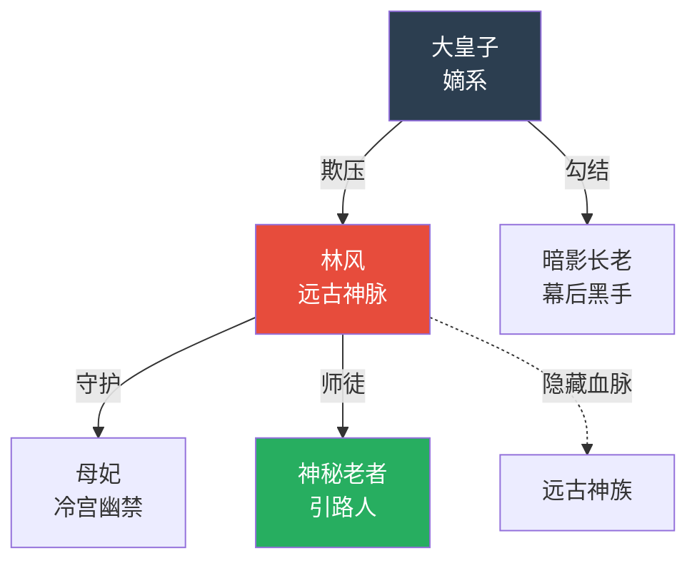

# 角色开发规范（漫剧版）

## 角色体系

漫剧角色需要比真人短剧更鲜明的视觉辨识度——因为没有真人演员的面部差异，AI生成的角色容易"撞脸"。角色设计的第一原则是「一眼能认出来」。

### 角色配额

| 类型 | 数量 | 要求 |
|------|------|------|
| 主角 | 1-2人 | 最完整的设计，视觉辨识度最高 |
| 核心配角 | 3-5人 | 围绕主角的关键人物，每人必须有独特视觉标志 |
| 功能角色 | 3-5人 | 推动特定剧情，外观可以稍简单但不能和主角撞 |
| 临时角色 | 按需 | 功能性强，黑衣人/路人可以不做详细设计 |

总计：主要角色5-7人，视觉上互不混淆。

## 角色信息表

为每个主要角色创建以下信息表：

| 字段 | 说明 | 示例 |
|------|------|------|
| **角色名称** | 姓名 + 别称/代号 | 林风（废柴七皇子/觉醒者） |
| **身份定位** | 故事中的功能角色 | 男主角 / 废柴觉醒者 |
| **年龄外貌** | 简洁直观 | 17岁，面容清秀但常年体弱显苍白 |
| **性格特征** | 2-3个核心词 | 隐忍、聪慧、爆发时果断 |
| **公开身份** | 别人以为他是 | 被废弃灵根的废柴皇子 |
| **真实身份** | 实际上他是 | 远古神脉传承者 |
| **当前目标** | 这阶段最想做什么 | 觉醒灵根，证明自己不是废物 |
| **核心动机** | 为什么要这么做 | 守护被欺辱的母亲，报父仇 |
| **冲突点** | 面临的主要矛盾 | 废柴身份与远古血脉的冲突 |
| **爽点功能** | 在爽点设计中的作用 | 觉醒时的碾压感、以弱胜强的反转 |

## 视觉锚点（漫剧新增·核心字段）

视觉锚点是让下游（无论是Agent还是人工）能快速建立角色视觉形象的关键信息。不需要写成完整的参考图提示词（那是Agent美术指导的活），但要提供足够明确的视觉关键词。

### 视觉锚点模板

为每个主要角色填写：

```
### 视觉锚点

- 发型发色：黑色短发，自然蓬松，刘海参差不齐
- 标志色：灰蓝色（衣服）+ 黑色（腰带/戒指）
- 标志配饰：左手无名指一枚古朴黑色戒指（关键道具）
- 体型轮廓：偏瘦不羸弱，肩线略窄
- 视觉关键词：清秀、苍白、内敛、不服输的眼神
- 与其他角色的区分点：唯一穿灰蓝色的角色，其他主角色系不重叠
```

### 视觉区分度检查

所有主要角色设计完成后，做一次视觉区分度检查：

| 检查项 | 要求 |
|--------|------|
| 发型差异 | 每个角色发型不同（长/短/束/散/颜色） |
| 标志色差异 | 每个角色有独属的主色调，不撞色 |
| 体型差异 | 至少3种体型：壮/瘦/中等/矮小 |
| 配饰区分 | 每人有一个标志性配饰或道具 |
| 整体辨识 | 如果把所有角色缩成黑色剪影，还能分辨谁是谁 |

### 表情情绪库

为每个主要角色预设3-5个常用情绪表情，写分集时直接引用：

```
### 林风 常用表情

| 情绪 | 画面描述 |
|------|----------|
| 隐忍 | 双唇紧抿，目光低垂，拳头在袖中握紧 |
| 冷笑 | 嘴角微微上扬，眼底没有笑意，瞳孔冰冷 |
| 觉醒 | 双瞳由黑变金，面部纹路浮现，嘴角带着释然的微笑 |
| 愤怒 | 眉头紧锁，额角青筋暴起，牙关紧咬 |
| 温柔 | 目光柔和，嘴角带着浅浅的弧度，眼底有光 |
```

## 角色弧线设计

### 主角弧线模板

```
起点状态 → 催化事件 → 初次觉醒 → 能力展现 → 挫折考验 → 终极蜕变
```

| 阶段 | 集数范围 | 主角状态 | 示例 |
|------|---------|---------|------|
| 起点 | 1-3集 | 被压抑/底层 | 废柴皇子被嘲笑 |
| 觉醒 | 3-10集 | 初步展现实力 | 灵根觉醒，初次碾压 |
| 崛起 | 10-25集 | 逐步展露力量 | 一次次以弱胜强 |
| 低谷 | 25-35集 | 遭遇重大挫折 | 血脉暴走/信任者背叛 |
| 爆发 | 35-50集 | 全面反击 | 真实力量完全释放 |
| 封神 | 50-60集 | 站上顶峰 | 所有人仰望 |

### 反派弧线模板

```
嚣张得意 → 初次受挫 → 加码反击 → 暂时得逞 → 全面溃败 → 跪地求饶
```

### 角色关系Mermaid图

使用Mermaid语法生成关系图，用不同颜色区分阵营：



## 角色互动场景预设

角色开发完成后，预设以下关键互动场景：

| 互动类型 | 涉及角色 | 预设场景 |
|----------|---------|---------| 
| 第一次正面冲突 | 主角 vs 主反派 | 什么场景、什么导火索 |
| 觉醒/变强展示 | 主角 vs 见证者 | 在什么场合展示力量 |
| 终极对决 | 主角 vs 终极BOSS | 对决形式和场景 |
| 感情确认（如有） | 男主 vs 女主 | 什么事件促使感情升温 |

## 角色设计原则

1. **一句话能说清**：每个角色必须能一句话定义
2. **外貌即性格**：视觉特征直接暗示性格
3. **台词即人设**：第一句台词就要建立人设
4. **每个角色为爽点服务**：答不上"这角色能贡献什么爽点"就删掉

完成角色开发后，引导用户输入 `~目录`。
