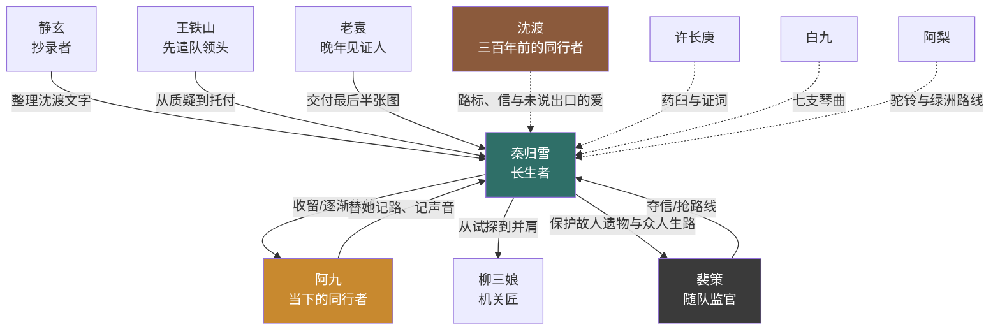

# 《三千鸦杀尽》第一季·角色档案（低成本版）

## 一、角色规模

第一季不限制随队探路者与迁民人数。当下核心人物固定为秦归雪、阿九、王铁山、裴策四人；裴策既是同行者，也是持续制造错误决策与争夺的核心反派。柳三娘是龟甲丘附近受雇修旧道的机关匠，第 21 集作为单元角色客串，第二季才正式加入。

其他随队人物均为低台词小配角、伤员、证人或阶段性反派，不建立固定人数和姓名账本。视觉上只准备少量通用背影与半身模型，通过换装、遮挡、远景和画外音表现大队伍。

过去线固定五人旧队：秦、沈渡、许长庚、白九、阿梨。为控制同屏复杂度，每段闪回常规只出现 2—3 人，其他人用镜外台词或下一个镜头承接。

单场原则：常规镜头 1—3 人，关键场面最多 6 人，不正面展示百人迁民大队。

## 二、当世主要角色

| 角色 | 身份与外形 | 性格与说话方式 | 本季目标 | 戏剧功能 |
|---|---|---|---|---|
| 秦归雪（外称“秦”） | 外貌约 24 岁，青衣、旧木剑、小布包；活过的岁月无法计算 | 温和、寡言、行动快于解释；常说“走”“别停”“我来” | 最初只是顺路西行；收到沈渡来信后，决定到敦煌收完他留下的东西 | 第一主角、冒险经验核心、情感承载 |
| 阿九 | 15 岁流浪儿，瘦、机灵，右眉有小疤 | 嘴快、怕死但不丢下人；会把沉重问题问得很直 | 找到一个不会赶他走的地方，并证明自己不是累赘 | 观众视角、秦与当下的情感锚点 |
| 柳三娘 | 34 岁，机关匠寡妇，腕缠铜线，带折弩与丈夫笔记 | 冷、利落，说话先报风险 | 受雇在龟甲丘外围修旧道，第一季客串判断晚年木楔；第二季加入，查清丈夫未走完的路线 | 机关解法、成人同盟、把冒险从单打变成协作 |
| 静玄 | 23 岁，年轻道士，旧袍、墨指、随身抄本 | 好奇、较真，见旧字会忘记害怕 | 第二季加入，整理沈渡沿路留下的文字 | 文字解读、信息归纳、轻微喜感 |
| 王铁山 | 46 岁，探路队领头，旧军出身，左耳缺角 | 粗硬、现实、护短；不讲空话 | 标出能让后方迁民安全通过的路线，尽可能把随队的人活着带出去 | 群体立场、现场决断、秦获得信任的标尺 |
| 裴策 | 38 岁，随队监官，衣着整洁，始终保护自己的地图匣 | 克制、精明，只谈功劳、风险与归属 | 抢到沈渡完整路线，先于所有人找到他认定的旧塔宝藏 | 持续的人类对手；制造夺图、误导与抢先冲突 |
| 老袁 | 63 岁，瘸腿勘探者，脸有深风纹 | 嘴毒、耐心，绝不说“肯定” | 第三季把沈渡晚年托付的最后半张图交给真正走对路的人 | 最后一程向导、沈渡晚年活证人 |

## 三、过去线角色

| 角色 | 一句话定义 | 与秦的关系 | 爱意或友情的落点 |
|---|---|---|---|
| 沈渡 | 把余生走成秦几百年后生路的普通人 | 最了解秦的人，爱她但从不要求她停下 | 每一次都先写哪里危险、哪里有水，最后才留一句想说的话 |
| 许长庚 | 嘴上嫌麻烦、手上从不让同伴流血的大夫 | 五人旧队医者 | 留下药臼与沈渡晚年行程的证词 |
| 白九 | 剑快嘴快、爱给每个人编曲的乐师剑客 | 与秦互损最多的朋友 | 留下《归雪》《问渡》《终章》七支曲 |
| 阿梨 | 会认星、找水、记每一片绿洲的少女向导 | 教秦用味道和铃声记路 | 留下七枚驼铃与最后一段绿洲路线 |

阿九与白九没有血缘、转世或命定联系。

### 旧队如何看沈渡与秦

- 许长庚最早看懂。他不催秦回应，只提醒沈渡：“你不说，她真能当你只是带路。”
- 白九会当面调侃偏心，用笑话替沈渡把情绪挑到桌面上。
- 阿梨曾劝沈渡把骨簪送出去。沈渡听见秦说“人和东西都留不久”后选择收回，阿梨因此心疼他。
- 三人都知道秦长生，也知道沈渡等不到。他们尊重沈渡不索取的选择，却在后来分别替他保存信、琴曲和驼铃。
- 旧队不能集体围着爱情起哄。他们首先是一起出生入死的朋友，调侃只占相处的一小部分。

## 四、角色代表性台词

- 秦归雪：“西边。你要跟，就别掉队。”
- 阿九：“我吃得少，跑得快。真遇上事，我还能替你喊人。”
- 柳三娘：“门能开。开错了，先塌左边。”
- 静玄：“等等，这几个字不是咒，是人在骂后来人别乱碰。”
- 王铁山：“人数我不数。少回来一个，我看得出来。”
- 裴策：“路是朝廷出钱探的，图就该归朝廷。”
- 老袁：“沙子不会骗人。拿图的人会。”
- 沈渡：“你别进。我先看看哪条会塌。”

## 五、人物关系

## 六、角色弧线

### 秦归雪：三季情感弧

| 季度 | 变化 |
|---|---|
| 第一季 1—24 | 从“沈渡只是可靠的同伴”走到承认“他对我与别人不同，我想继续找下去” |
| 第二季 1—24 | 从不断替沈渡的偏心寻找理由，走到明确知道他爱她，也承认自己醒悟得太晚 |
| 第三季 1—32 | 从执着收回所有旧物，走到理解沈渡真正希望她继续活、继续与人同行 |

### 沈渡：过去线弧

| 阶段 | 变化 |
|---|---|
| 同行初期 | 把偏爱藏在领路责任里，自己也不肯承认 |
| 同行中期 | 旧队纷纷看破；他会吃醋、会失控担心，却始终不替秦决定 |
| 分别之前 | 明知两人寿命悬殊，决定不索要承诺，只教她以后能独自活下去的方法 |
| 分别之后 | 没有守在原地耗尽一生，而是用十二年反走旧路，把等待变成可供秦使用的生路 |
| 晚年终点 | 接受秦可能永远不会回来、也可能回来时已经忘记他；仍完成所有托付 |

### 阿九：从被带着走，到替秦看懂过去

| 季度 | 变化 |
|---|---|
| 第一季 | 从抓秦衣角到参与破关，并替观众问出“他是不是喜欢你” |
| 第二季 | 学会路标和绳结，也意识到自己不能要求秦立刻回应一个已死之人 |
| 第三季 | 替秦保存险些遗失的竹片，在废塔成为救人关键 |

### 柳三娘

第一季第 21 集，秦等人在龟甲丘外围遇到受雇修旧道的柳三娘。她只负责判断晚年木楔和说明结构风险，不占用核心队伍名额；第二季正式加入，由只查亡夫旧路走向继续替后来人留路；第三季在废塔与秦完成互救。

### 静玄

第二季加入。起初想研究旧史，后来发现沈渡留下的不是宏大秘密，而是一份能让普通人活下来的《西行录》。

### 裴策：把情书误读成藏宝图的人

| 季度 | 变化 |
|---|---|
| 第一季 | 从谨慎监官变为觊觎路线，争簪、拔销，但仍只是现实阻力 |
| 第二季 | 多次因只看利益而读错沈渡路标，逐渐成为持续追逐者 |
| 第三季 | 抢先入塔引发坍塌，被秦放下信匣救回，最终承认自己把别人的一生看成了价码 |

## 七、关键互动场景

### 秦与阿九：声音忘了

阿九问沈渡说话是什么样。秦想了很久：“我记得他不爱高声。别的……忘了。”阿九晃一下铜铃：“那先记这个。下回我也忘了，你再晃给我听。”

### 秦与沈渡：第一季的爱意定义

过去线不出现正式表白。沈渡最接近表白的两句话是：“凭我会怕。你不会。”以及季终的：“图她走到这里时，少受一点伤。”

秦当年不是故意伤害他，而是根本不理解短命之人为何会对“永远”抱有期待。她看到照顾，却没有给照顾命名。

### 秦与裴策：路线属于谁

裴策：“图交给朝廷，能换钱、换粮、换官道。留在你手里，只是几封死人信。”

秦：“所以你看不懂。他写的不是哪里有钱，是哪里能活。”

### 第三季终局：先救人

最后的信匣即将落入深坑，裴策和柳三娘同时被落梁困住。秦只看信匣一眼，转身抬木楔救人。她没有说理由。碑室打开后，沈渡最后一封信证明，这正是他希望她做出的选择。

## 八、人物使用约束

- 秦不施法、不发光、不凭血开门；每次解题都必须有可见依据。
- 秦可以强，但大型危险必须依赖地形和至少一名队友。
- 阿九可以害怕，不能靠反复闯祸推动剧情。
- 柳三娘懂结构，不懂所有旧字；静玄懂文字，不懂所有机关。
- 裴策不知道秦的身世，也不把她当远古钥匙。
- 沈渡的回忆只展示行动，不展示预言和宏大使命。
- 过去线常规 2—3 名主要角色同框，复用当下地点并改为暖色、完整版本。
- 第一季必须让许长庚、白九、阿梨各自至少一次看出或评论沈渡的偏爱，但不能代替沈渡表白。
