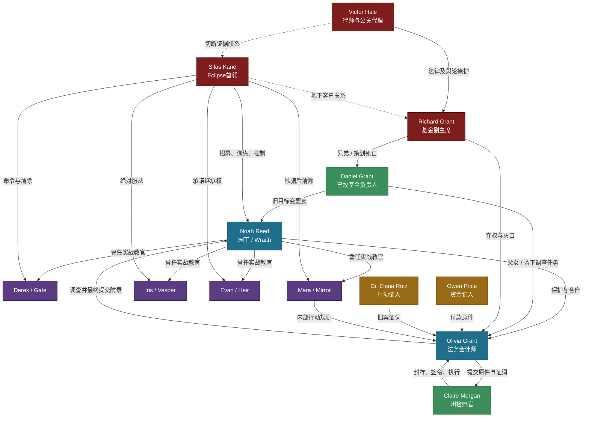

# 《别惹那个园丁》角色档案

## 一、角色配置原则

- **制作模式**：海外仿真人原创
- **核心人物**：Noah、Olivia、Daniel、Mara、Richard、Silas
- **阶段人物**：Derek、Iris、Evan、Owen、Elena、Victor、Claire
- **演员控制**：四名旧徒分阶段接力；Owen与Elena完成证词后减少场次；Daniel主要通过旧监控、录音、照片及回忆出现。
- **关系原则**：Noah与Olivia是双强证据搭档，不写成“男主负责一切、女主只负责被救”；两人有克制的情感张力，但第一季不仓促确立恋爱关系。
- **反派原则**：Richard控制本地权力，Victor控制法律与舆论外壳，Silas控制杀手组织；三人利益相连但功能不重复。

## 二、角色总表

| 角色 | 身份定位 | 年龄与视觉锚点 | 性格关键词 | 公开身份 / 真实身份 | 目标与动机 | 核心冲突 | 爽点功能 |
|------|----------|----------------|------------|---------------------|------------|----------|----------|
| **Noah Reed / Wraith** | 男主、隐世高手、赎罪者 | 38岁；精瘦结实，腕部旧伤，旧园艺手套 | 克制、敏锐、独断 | 流动园丁 / Eclipse前王牌兼教官 | 完成Daniel托付，终止自己制造的暴力循环 | 保护完整真相，也意味着交出自己的罪证 | 园丁反差、实力碾压、师徒反制、主动担责 |
| **Olivia Grant** | 女主、证据搭档、真相执行者 | 30岁；利落深色套装，银色旧表 | 理性、强硬、守界限 | 基金代理负责人 / 主动追查父亲死因的法务会计师 | 保住基金、查明父亲死亡、让证据合法落地 | 救命恩人与历史加害者是同一个人 | 专业打脸、双强协作、终局提交 |
| **Daniel Grant** | 已故引路人、旧目标、谜局设计者 | 63岁；橄榄色园艺外套，旧修枝剪 | 温和、谨慎、固执 | 慈善基金负责人 / Noah的秘密盟友 | 让证据和女儿都活下来 | 信任Noah，却不替Noah逃避责任 | 死后反转、花园谜局、价值定锚 |
| **Mara Voss / Mirror** | 旧徒、猎手转证人 | 32岁；可快速换装的灰色层叠服装 | 冷静、多疑、重承诺 | 外部调查顾问 / Eclipse渗透者 | 查清Noah为何离开，并决定自己服从谁 | 恨Noah抛弃她，却不断看见Silas撒谎 | 猎人反噬、倒戈、师徒情感冲突 |
| **Richard Grant** | 本地权力反派、家族背叛者 | 57岁；昂贵丧服，Grant家族领针 | 体面、贪婪、控制欲强 | 基金副主席、慈善家 / 洗钱通道经营者 | 在监管复核前夺取基金控制权 | 必须维持家族体面，却亲手害死兄长 | 夺权压迫、公开打脸、家族清算 |
| **Silas Kane** | 终极反派、精神控制者 | 61岁；深色长外套，旧式袖扣 | 冷静、自负、操控成瘾 | 风险管理公司负责人 / Eclipse首领 | 销毁客户链并逼Noah重新成为Wraith | 他必须证明“人不会改变”，否则体系失去意义 | 师徒终局、价值对决、终极溃败 |
| **Derek Shaw / Gate** | 第一轮猎手 | 35岁；标准安保制服，旧门禁卡 | 自负、守规则、怨恨 | 伪造履历的庄园安保主管 / Eclipse入口专家 | 销毁第一层证据，证明Noah已经过时 | 第3集身份暴露后失去公开权限，只能潜入行动 | 前期打脸对象、身份微露发动机 |
| **Iris Vale / Vesper** | 第三轮猎手 | 30岁；干净中性色服装，薄医用手套 | 冷淡、精确、服从 | 风险评估顾问 / 事故伪装专家 | 把证人和证据变成“自然损失” | 把命令当道德，拒绝承认选择存在 | 事故反杀、环境智斗、冷酷对照 |
| **Evan Cross / Heir** | 终局猎手、错误继承人 | 27岁；模仿Noah的深色夹克与腕带 | 好胜、偏执、渴望认可 | 年轻安保精英 / Wraith候选继承人 | 击败Noah，获得Silas正式命名 | 模仿Noah的能力，却不理解他的改变 | 新旧Wraith对决、心理二选一 |
| **Owen Price** | 资金链证人 | 46岁；旧风衣，随身折叠收据 | 谨慎、内疚、数字敏感 | 离职会计 / 被迫经手洗钱付款的人 | 保护家人并说出自己签过的账 | 作证会暴露自己曾经的协助行为 | 资金证据落地、普通人反抗 |
| **Dr. Elena Ruiz** | 行动链证人、道德证人 | 41岁；实用风衣，磨损急救包 | 直接、坚韧、不轻易原谅 | 社区诊所医生 / Eclipse旧行动幸存见证者 | 让受害者恢复姓名 | Noah救过她，也参与过伤害平民的行动 | 拒绝洗白主角、揭开双重合同 |
| **Victor Hale** | 法律与舆论反派 | 43岁；精裁西装，酒红领带，文件夹 | 圆滑、冷酷、风险导向 | Richard的首席律师 / Eclipse法律隔离层 | 切断Richard与客户的证据联系 | 他只相信可控版本，却被完整原件击败 | 舆论栽赃、程序对抗、删减报告诱惑 |
| **Claire Morgan** | 固定司法角色 | 45岁；深蓝西装、蓝色封存袋、签令夹 | 克制、直接、重程序 | Ravenport州检察官 | 把线索转化为可执行的搜查、冻结与逮捕 | 证据不完整时不能提前行动 | 司法落地、终局执行、减少法律解释 |

## 三、核心人物详档

### 1. Noah Reed / Wraith

**一句话定义：** 一个已经学会让植物活下来的前杀手，必须把自己也写进最终罪证。

- **年龄**：38岁
- **公开身份**：持合法民事身份与真实园艺履历的流动园丁
- **隐藏身份**：Eclipse前王牌行动员、26—31岁期间的实战教官，代号Wraith
- **外貌**：身形精瘦而非夸张健美；面部线条冷硬，常有户外劳作留下的轻微晒痕；右腕有一道七年前留下的弧形伤疤。
- **日常造型**：褪色橄榄绿工装、旧靴、修补过一次的深棕园艺手套。
- **Wraith造型**：脱去外层园艺围裙后只剩贴身深色工作服；不更换华丽战衣，让身份转换主要通过站姿、目光和动作节奏完成。
- **核心道具**：修补过的园艺手套、Daniel的养护合同、旧腕伤、象征Wraith身份的枪。

**能力边界：**

- 擅长风险预判、反跟踪、保护性驾驶、近身控制、急救和临场布防；
- 能读懂植物位置、养护异常与Daniel留下的园艺习惯；
- 不懂复杂财务、司法取证和基金治理，必须依赖Olivia；
- 坚持非致命控制后，部分旧战术不能再使用，面对学生时并非无敌；
- 每暴露一种旧手法，Evan和Iris就能针对性调整，能力展示同时带来风险。

**核心欲望：** 完成Daniel最后的托付，让Olivia和证据活下来。

**深层需求：** 承认“独自承担”仍是一种控制；把选择权还给Olivia、Mara和受害者。

**最大恐惧：** 四名旧徒证明他只会制造新的Wraith；Olivia知道真相后发现他从未真正改变。

**全剧行动命题：**

> 一个真正改变的人，不会再替别人选择谁该牺牲。

四名旧徒分别逼他回答一次：先救人还是先完成任务、是否替学生决定、非致命原则是否愿意付出真代价、是否还会制造下一任Wraith。

**秘密层级：**

1. 第3集：Guard A叫出Wraith；
2. 第12集：Olivia发现Wraith在Eclipse内部早已死亡；
3. 第30集：Daniel录音证明Noah最初来杀Daniel父女；
4. 第40集：Noah参与过造成平民死亡的旧行动；
5. 第55—59集：他找到足以追究自己的Wraith附录，并主动交出。

**语言习惯：**

- 台词短，不解释已能通过动作表达的信息；
- 判断危险时使用命令句：“退后。”“别碰。”“看门。”
- 面对旧徒时称呼真名，不叫代号，表示拒绝Silas定义；
- 谈园艺时语气会明显放缓，这是他少数允许自己温和的时刻。

**首句台词：**

> “别上车。”

**角色弧线：**

| 阶段 | 集数 | 状态变化 |
|------|------|----------|
| 隐身 | 1—3 | 只想完成托付，不愿解释过去；能力第一次暴露 |
| 被迫留下 | 4—12 | 保护Olivia并守证据，Wraith身份开始反噬 |
| 半真半假 | 13—30 | 承认代号却隐瞒双重灭口合同；为救Elena失去唯一原件，最终同时失去Olivia信任和基金主场 |
| 放弃独断 | 31—45 | 接受受监督合作，让Olivia安排证据路线，让Mara自己选择作证 |
| 主动入局 | 46—55 | 用Wraith身份假投诚，但不再替团队隐瞒计划和代价 |
| 完成赎罪 | 56—60 | 拒绝杀死Mara，击败Silas，主动交出Wraith附录并停止逃亡 |

### 2. Olivia Grant

**一句话定义：** 她需要园丁救自己的命，却必须亲手把救命恩人的罪证送进检察官办公室。

- **年龄**：30岁
- **身份**：Grant Foundation代理负责人、注册法务会计师
- **外貌**：五官清晰利落，眼神直接；常把头发束起，工作状态几乎没有多余配饰。
- **前期造型**：海军蓝或炭灰套装、低跟鞋、Daniel留下的银色机械表。
- **中后期造型**：进入花园和仓库后换成衬衫、长裤和短风衣，但仍保留银表，强化她不是突然变成动作人物。
- **核心道具**：银表、原始总账扫描、证据封存标签、删减报告。

**专业边界：**

- 擅长法务会计、付款追踪、文件核验和证据保管；
- 能判断一份材料是怀疑、线索还是可提交证据；
- 不会突然精通格斗或潜入，危险场面依靠判断路线、保存材料和调度人员发挥作用；
- 她可以暂停基金内部付款，但不能随意冻结外部银行账户或签发司法命令。

**核心欲望：** 查明Daniel死亡真相，保住基金不被Richard夺走。

**深层需求：** 学会在感情、恩情和事实冲突时，不把“保护某个人”变成删改真相。

**最大恐惧：** 自己坚持完整证据会毁掉Noah；自己选择隐瞒又会变成另一个Richard。

**主动性节点：**

1. Daniel死前拒绝补签异常付款并复制总账；
2. 第1集撕毁Richard的紧急代理授权；
3. 第6集用门禁时间拆穿伪造监控；
4. 第7集提前保存采购原册扫描与封存编号；
5. 第15集公开聘请Noah，同时建立调查档案；
6. 第30集被暂停基金权限后，立即把个人保存材料转向Claire；
7. 第33集在Claire见证下提出合作规则；
8. 第45集把当前案原件装入Claire的蓝色封存袋；
9. 第50集在董事会上击破Richard、夺回公开主动权；
10. 第59集亲手提交Wraith附录。

**语言习惯：**

- 不说“我觉得”，直接问金额、日期、签名和权限；
- 情绪越重，问题越短；
- 对Richard使用正式称谓，拒绝让“家人”模糊责任；
- 对Noah从“Mr. Reed”逐步变为“Noah”，但发现旧案后又短暂恢复全名称呼。

**首句台词：**

> “我父亲刚下葬，你就想接管他留下的一切？”

**角色弧线：**

| 阶段 | 集数 | 状态变化 |
|------|------|----------|
| 主动抵抗 | 1—3 | 拒绝叔父夺权，因调查成为目标 |
| 有限合作 | 4—12 | 借助Noah保住第一层证据，同时开始怀疑他的身份 |
| 双向调查 | 13—30 | 一边与Noah找证人，一边查他；得知双重灭口合同后决裂，并被Richard暂停基金权限 |
| 失权重建 | 31—45 | 不再依赖基金职务或私人信任，从个人材料出发建立受司法监督的新证据路线 |
| 公开反击 | 46—55 | 主导董事会和证据提交，夺回基金主动权 |
| 完整选择 | 56—60 | 撕毁删减报告，提交Noah旧案材料；尊重他，但不替受害者原谅 |

### 3. Daniel Grant

**一句话定义：** 一个死后仍在指导调查的人，但他留下的最后一道题，是让女儿不要偏袒自己的救命恩人。

- **年龄**：63岁
- **身份**：Grant Foundation前负责人、Noah当年的暗杀目标与后来的秘密盟友
- **外貌**：银灰短发，面容温和但眼下常带疲惫；在正式西装外常套一件旧橄榄色园艺外套。
- **核心道具**：旧修枝剪、温室钥匙、养护合同、半封遗信、项目册。
- **出现方式**：葬礼照片、旧监控、短录音、文件批注及少量七年前回忆；每次出现必须释放新信息，不安排重复缅怀。

**核心欲望：** 在不触发Eclipse立即清洗的前提下留下可验证证据。

**核心缺陷：** 太相信自己能控制风险，长期隐瞒使Olivia在他死后才被迫面对全部危险。

**对Noah的态度：** 相信他可以改变，但拒绝替他宣布无罪。

**语言习惯：** 喜欢用简单园艺事实说人，不连续讲大道理；每句话在后文都有第二层含义。

**代表台词：**

> “让他保护你，也要查清他。”

**死后信息弧：**

| 节点 | 新信息 |
|------|--------|
| 1—2集 | 他提前聘请Noah，并留下温室暗号 |
| 12集 | Noah第一次来到庄园是为了杀他 |
| 30集 | 合同还要求杀死Olivia |
| 40集 | 项目册指向单独的Wraith附录 |
| 51—55集 | “重要植物留双份”指向附录真实藏处 |
| 59集 | 他没有替Noah删名，把最终选择留给Noah和Olivia |

### 4. Mara Voss / Mirror

**一句话定义：** 最擅长变成别人的女人，第一次决定不再替任何教官活。

- **年龄**：32岁
- **公开身份**：基金会外聘调查顾问
- **真实身份**：Eclipse渗透与身份伪装专家，代号Mirror
- **外貌**：冷白肤色，表情控制极好；发型和妆容可以快速改变，但左耳后有一道极浅训练伤。
- **造型锚点**：灰色层叠西装、可反穿外套、两种不同框型眼镜；倒戈后去掉用于伪装的眼镜和假工牌。
- **核心道具**：调查证件、旧任务硬币、Iris的行动编号。

**核心欲望：** 确认Noah当年究竟是抛弃学生，还是发现了Silas的谎言。

**深层需求：** 接受服从不是忠诚，别人替她承担过责任也不等于能替她做一生选择。

**关键前史：** Noah曾替她承担一次任务失误；Silas把这件事改写成“Noah利用完她便逃走”。

**两次转变必须分开：**

1. 第20集看见Owen只是普通会计，主动把他送出封锁，因此被Silas烧毁伪装身份并列入清除名单；
2. 第27集在已成为猎物的情况下仍主动救出Elena，并留下Iris编号。

**语言习惯：**

- 前期习惯重复对方最后几个字，迫使对方暴露更多；
- 不轻易使用“相信”一词；
- 真正倒戈后不说效忠宣言，只交出能被核验的行动规则。

**首句台词：**

> “我不信档案。我信人撒谎时先看哪边。”

**角色弧线：**

| 阶段 | 集数 | 状态变化 |
|------|------|----------|
| 渗透 | 13—19 | 以顾问身份接近Olivia，观察Noah |
| 猎人变猎物 | 20—26 | 主动放走Owen，伪装身份被烧毁并列入清除名单 |
| 主动违令 | 27—34 | 在被追杀状态下仍放过Elena，不再以服从换生存 |
| 自主选择 | 35—44 | 接受Noah保护但不恢复服从，最终决定作证 |
| 证人 | 45—60 | 交出行动确认体系，拒绝Silas最后的忠诚测试 |

### 5. Richard Grant

**一句话定义：** 他把“家族体面”挂在嘴上，却为了保住体面杀死亲哥哥。

- **年龄**：57岁
- **身份**：Grant Foundation董事会副主席、Daniel弟弟
- **外貌**：保养精致，笑容有亲和力；葬礼也佩戴低调但昂贵的Grant家族领针。
- **造型锚点**：黑灰高级套装、始终整齐的口袋巾；职权被暂停后领针被董事会工作人员取下。
- **核心道具**：紧急代理授权、董事会票夹、未获Daniel签字的大额付款文件。

**核心欲望：** 在监管复核前获得基金控制权，掩盖医疗项目洗钱。

**深层恐惧：** 被公众确认自己只是靠Daniel声誉活着的弟弟。

**行动逻辑：**

- 前期用亲属身份逼Olivia交权；
- 中期用施工、董事会和舆论合法外衣毁证据；
- 后期在资金链即将闭环时直接绑架Owen，暴露体面外壳；
- 他不是Eclipse最高层，只是主动把家族资源卖给组织的人。

**语言习惯：** 高频使用“家里”“体面”“为了基金”，从不在公开场合直接说威胁。

**首句台词：**

> “家里现在需要一个能做决定的人。”

**反派弧线：**

体面夺权 → 花园受阻 → 借Victor反咬 → 第30集暂时控制基金 → 强拆花园并封锁资料 → 绑架Owen暴露 → 第50集被暂停职权并接受刑事调查。

### 6. Silas Kane

**一句话定义：** 他最想杀死的不是Noah，而是“Noah真的能够改变”这个事实。

- **年龄**：61岁
- **公开身份**：Eclipse风险管理公司负责人
- **真实身份**：地下行动网络首领，Noah和四名旧徒的招募者、教官
- **外貌**：身材高瘦，灰白头发梳理整齐；没有明显武装感，像一名过度冷静的企业导师。
- **造型锚点**：深色长外套、旧式金属袖扣；袖扣图案与Wraith附录上的复核码构图呼应。
- **核心道具**：行动确认终端、Wraith象征枪、旧式袖扣。

**核心欲望：** 销毁Daniel证据，恢复Eclipse客户对组织的信任。

**深层需求（他拒绝面对）：** 承认被自己塑造成工具的人仍能作出道德选择。

**最大弱点：** 极度自负于训练体系；当Noah说要带Wraith附录回来完成效忠，他必须亲眼确认自己的作品仍属于自己。

**语言习惯：**

- 从不提高音量；
- 把杀人称为“完成”、把服从称为“通过”、把操控称为“课程”；
- 总叫Noah“老师”，既讽刺他训练旧徒，也故意把责任全部推回给他。

**首句台词：**

> “确认。老师回来了。”

**反派弧线：**

第3集通过耳麦确认Wraith存活 → 第9集当场抛弃失败的Gate → 第12集重新点亮Wraith档案 → 把Mirror从猎手变成猎物 → 利用Noah旧罪取得舆论优势 → 带着怀疑测试假投诚 → 为Wraith附录亲赴温室 → 被Noah拒绝杀人和合法录音同时击败。

## 四、阶段人物详档

### 1. Derek Shaw / Gate

- **一句话定义**：相信控制入口就能控制所有人的第一名旧徒。
- **年龄**：35岁
- **欲望**：证明自己比离开的老师更可靠。
- **弱点**：过度依赖门禁、权限和固定撤离路线。
- **与Noah的镜像**：继承Noah的空间控制，却没有学会根据人命改变计划。
- **视觉锚点**：标准安保制服、磨旧门禁卡、总把出口保持在视线内。
- **语言锚点**：“没有权限，就没有路。”
- **阶段状态**：葬礼前凭Richard提供的伪造履历换入庄园；第3集绑架失败后丢下Guard A逃走，安保身份作废；Olivia随即撤销其全部权限，第4—7集由Richard秘密新建维护服务账户并开启维修窗口，Derek只能沿服务通道便装潜入。
- **退场方式**：第9集在公共监控和耳麦回传中自证，采购原册被追回；此后仅通过调查进展或听证结果交代。

### 2. Iris Vale / Vesper

- **一句话定义**：把每次谋杀都称为概率事件的事故设计者。
- **年龄**：30岁
- **欲望**：证明服从命令比人的主观判断更可靠。
- **弱点**：相信环境可计算，却低估证人会彼此保护。
- **与Noah的镜像**：继承他的环境观察，却把观察用于取消人的选择。
- **视觉锚点**：无标识中性色服装、薄医用手套、永远干净的鞋。
- **语言锚点**：“没人动手。只是概率站错了边。”
- **结局**：被Silas放弃后仍拒绝作证，最终依据行动记录和现场证据被捕。

### 3. Evan Cross / Heir

- **一句话定义**：模仿Wraith所有动作，却始终等不到一句“你就是继承人”的年轻杀手。
- **年龄**：27岁
- **欲望**：让Silas正式承认自己取代Noah。
- **弱点**：把Noah的每个选择都理解成胜负，无法理解放下枪也能是胜利。
- **与Noah的镜像**：他是Noah若从未遇见Daniel可能成为的人。
- **视觉锚点**：模仿Noah的深色夹克，在无伤的手腕缠同款护带。
- **语言锚点**：“你会选哪一个？我知道答案。”
- **结局**：温室中等待Noah杀死Mara后接任Wraith，却被Noah以非致命方式控制。

### 4. Owen Price

- **一句话定义**：一个把犯罪数字填进表格后，终于决定给每个数字写回人名的普通会计。
- **年龄**：46岁
- **欲望**：保护家人，同时结束长期逃亡。
- **负罪点**：明知部分采购异常，仍因恐惧签过原始付款页。
- **证据功能**：证明植物采购款如何进入Eclipse外围公司。
- **视觉锚点**：皱旧风衣、折叠收据、右手拇指长期沾着复写纸墨迹。
- **语言习惯**：紧张时先报错一个数字，再立即纠正；真正作证时第一次完整说出Richard名字。
- **首句台词**：“我没偷钱。数字是我的，钱不是。”

### 5. Dr. Elena Ruiz

- **一句话定义**：她可以证明Noah被骗，却拒绝让“被骗”变成免罪。
- **年龄**：41岁
- **身份**：海外援助医生，现经营社区诊所
- **欲望**：让被写成“危险目标”的普通人恢复姓名。
- **证据功能**：把灌溉行动日期、受害者身份和Noah旧行动连接起来。
- **视觉锚点**：实用风衣、磨损急救包、写满人名的旧医疗记录夹。
- **语言习惯**：不使用“目标”“附带损失”等词，强迫对方说出受害者姓名。
- **首句台词**：“别叫他们目标。你记得他们的名字吗？”

### 6. Victor Hale

- **一句话定义**：从不否认真相，只负责把真相裁剪到无法伤害客户。
- **年龄**：43岁
- **身份**：Richard首席律师兼公关代理、Eclipse法律隔离层
- **欲望**：保住客户匿名性，让所有责任停在Richard一层。
- **弱点**：相信文件版本可以控制现实，低估Noah会主动交出原件。
- **视觉锚点**：炭黑精裁西装、酒红领带、无折痕文件夹；被捕时文件第一次散落。
- **语言习惯**：不用“销毁”“说谎”，只说“修订”“风险”“不可采信”。
- **首句台词**：“真相不是问题。能不能被采信，才是。”
- **结局**：删减报告被Olivia当面撕毁，其伪造授权与绑架协助进入刑事调查。

### 7. Claire Morgan

- **一句话定义**：她不负责相信任何人，只负责确认哪件证据能让法官签字。
- **年龄**：45岁
- **身份**：Ravenport州检察官
- **欲望**：在不破坏证据资格的前提下切断Eclipse资金与行动网络。
- **功能边界**：不参与格斗，不替Olivia查账，也不凭一段录音直接定罪。
- **视觉锚点**：深蓝西装、蓝色封存袋、夹着红色签页的法官签令。
- **语言习惯**：把专业问题压成短问句：“原件呢？”“谁碰过？”“法官批了吗？”
- **阶段作用**：第31集接案，第45集申请现场取证令，第52集完成设备布置，第59集执行搜查、冻结与逮捕。

## 五、四徒镜像设计

| 旧徒 | 继承Noah的能力 | 扭曲后的信条 | Noah的反制方式 | 最终证明 |
|------|----------------|--------------|----------------|----------|
| Derek | 控制入口 | 有权限的人决定谁能活着离开 | 把对抗移到公共监控和警方程序中 | 规则也能限制施暴者 |
| Mara | 观察与适应 | 活下来就必须成为别人想看见的人 | 不要求她重新效忠，让她自己选择是否作证 | 适应不等于失去自我 |
| Iris | 利用环境 | 只要像事故，就没人需要负责 | 保住证人和交叉记录，让“事故”恢复因果 | 概率不能替人承担罪责 |
| Evan | 预判选择 | 人在压力下永远会选择杀人 | 放下枪并完成非致命控制 | 拒绝题目本身也是选择 |

## 六、人物关系图

## 七、关键关系弧线

### Noah × Olivia：保护不等于免罪

| 阶段 | 关系状态 | 戏剧表达 |
|------|----------|----------|
| 1—3集 | 陌生园丁与警惕雇主 | Noah救命，Olivia仍要求查看合同和身份 |
| 4—12集 | 功能性合作 | 两人用“双钥匙”解开第一层，Olivia发现Wraith身份 |
| 13—30集 | 互相需要、互相调查 | Olivia公开聘用他，却建立秘密档案；双重灭口合同导致决裂 |
| 31—45集 | 有规则的重新合作 | 不谈原谅，只谈证据路线、授权和保管链 |
| 46—58集 | 深度互信 | Olivia配合假投诚，但保留停止计划的权力 |
| 59—60集 | 尊重与责任并存 | Olivia提交附录；Noah接受她的决定，两人不以爱情抵消旧罪 |

### Noah × Mara：老师不再替学生选择

Noah前期想命令Mara离开，中期改为向她展示证据，后期只问一句“你要作证吗”。Mara最终不是回到Noah阵营，而是成为独立证人。

### Noah × Silas：两种“教导”

Silas认为训练就是剥夺选择；Noah最终通过承认自己的教官责任、拒绝杀人和停止培养继承人，否定Silas整套体系。

### Olivia × Richard：家族体面与公共责任

Richard不断用亲属关系要求Olivia内部解决。Olivia从撕毁代理授权，到董事会公开资金证据，再到监管听证确认责任，逐步把“家事”变回公共案件。

## 八、关键互动场景预设

| 互动类型 | 角色 | 场景与导火索 | 必须完成的角色变化 |
|----------|------|--------------|--------------------|
| 第一次正面冲突 | Olivia vs Richard | Daniel葬礼后，Richard逼签紧急代理授权 | Olivia先主动撕文件，再进入车辆危机 |
| 第一次能力兑现 | Noah vs Derek | 温室地下装卸区绑架 | Noah不用杀人完成碾压；Guard A叫出Wraith，Silas远程确认老师归来 |
| 关系第一次站队 | Olivia vs 全体董事 | 第15集公开聘请Noah | 她既保护合作权，也宣布会调查Noah |
| 关系决裂／权力崩塌 | Olivia vs Noah／Richard | 第30集双重灭口合同曝光，Richard同步夺权 | Olivia将Noah逐出安全屋并失去基金权限，关系与合法主场同时崩塌 |
| 关系重建 | Noah vs Olivia | 第33集Claire办公室 | 两人以规则代替私人承诺，建立新的合作协议 |
| 旧徒转折 | Mara vs Noah | Mara被Eclipse追杀后 | Noah不要求效忠，Mara自行决定作证 |
| 当众打脸 | Olivia vs Richard | 第50集基金董事会 | Olivia用原始付款和Owen证词暂停Richard职权 |
| 身份全揭 | Noah vs Silas | 第55集Wraith附录出现 | Silas被迫亲自入局，Noah承认自己也在附录里 |
| 终极对决 | Noah vs Silas / Evan | 第57—58集温室 | Noah拒绝杀Mara，以非致命方式击败旧体系 |
| 不以原谅收尾 | Noah vs Olivia | 第59集证据提交 | Noah主动交附录，Olivia亲手提交；尊重代替免责 |

## 九、台词区分表

| 角色 | 句式与语气 | 禁止写法 |
|------|------------|----------|
| Noah | 极短命令句；危险判断先于解释 | 长篇忏悔、每场都说植物哲理 |
| Olivia | 数字、日期、权限式追问；愤怒时更短 | 依赖式哭喊、突然变成法律百科 |
| Daniel | 简短园艺隐喻，一句话两层含义 | 每段录音都解释完整答案 |
| Mara | 反问、复述对方关键词、保留判断 | 突然煽情认师、长篇效忠宣言 |
| Richard | “家里、体面、基金”为包装 | 公开承认洗钱或直接自曝 |
| Silas | 教官口吻，冷静使用“课、规则、通过” | 咆哮式反派、无目的杀人狂 |
| Derek | 权限、入口、程序化短句 | 与Silas相同的哲学台词 |
| Iris | 概率与事故式冷话 | 详细讲解可复制的伤害方法 |
| Evan | 二选一、模仿Noah旧话 | 单纯年轻冲动、无继承执念 |
| Owen | 数字化、自我纠正、紧张停顿 | 突然勇猛或精通行动战术 |
| Elena | 说人名，拒绝组织术语 | 轻易原谅Noah、替他洗白 |
| Victor | 法律委婉语、版本与风险 | 低级威胁、街头反派口吻 |
| Claire | 极短程序问句；只说原件、封条、签令 | 站着长篇讲法律条文 |

## 十、分阶段出场与退场控制

| 集数 | 重点人物 | 控制策略 |
|------|----------|----------|
| 1—12集 | Noah、Olivia、Richard、Victor、Derek、Daniel资料；Silas仅声音/终端 | 先建立双主角与第一名旧徒，让终极反派持续压场但不提前真人进城 |
| 13—20集 | 加入Mara、Owen；Derek退出主场 | Mara同时承担渗透者和情感旧债，Owen只负责资金线 |
| 21—30集 | 加入Iris、Elena；Owen减少场次 | Iris接替动作威胁，Elena承担旧案道德证词 |
| 31—45集 | Mara、Iris、Evan成为主冲突；Claire固定承接司法程序 | 证人集中进入司法程序，不长期占用追逐场 |
| 46—55集 | Silas由远程转现实出场；Claire完成签令与设备布置 | 终极反派接管冲突，避免旧徒继续平均分戏 |
| 56—60集 | Noah、Olivia、Mara、Iris、Evan、Silas、Richard、Victor、Claire | 动作终局与公开清算分开，证人只在必要节点出现 |

## 十一、角色一致性硬规则

1. Noah不能突然精通财务和法律；Olivia不能突然拥有杀手级格斗能力。
2. Olivia可以感谢、信任甚至关心Noah，但不能替受害者宣布原谅。
3. Mara倒戈必须经过第20集救Owen并被列入清除、第27集再救Elena两次事件；第一次让她失去身份，第二次才完成主动背叛。
4. Iris被Silas抛弃后仍拒绝倒戈，保持她“命令即道德”的悲剧一致性。
5. Evan要始终追求“被命名为下一任Wraith”，不是无缘由嫉妒Noah。
6. Richard所有公开行为都必须披着基金、家族或程序外衣，直到绑架Owen才彻底撕掉体面。
7. Victor不直接指挥专业杀手动作，只处理授权、舆论、文件和责任隔离。
8. Silas必须到后期才亲自进入Ravenport主场，他的现身由Wraith附录强制触发。
9. Daniel的每段遗留信息只能解决一个问题，同时制造一个更大的问题。
10. 任何情感升温都不能中断证据主线，第一季不以婚恋承诺收尾。
11. 第26集被毁的两名受害者同期医疗记录不得通过扫描件、云备份或新证人恢复；这项损失必须永久保留。
12. 第30—50集Olivia不得继续像拥有基金权限一样调用内部系统、安保或人员，直至她通过董事会和监管程序夺回控制权。

## 十二、下一阶段

角色档案与60集目录已完成，第1—3集正文已按海外仿真人规格修复。下一阶段从第4集继续撰写，每次1—3集，并执行项目内的分集规格检查。
