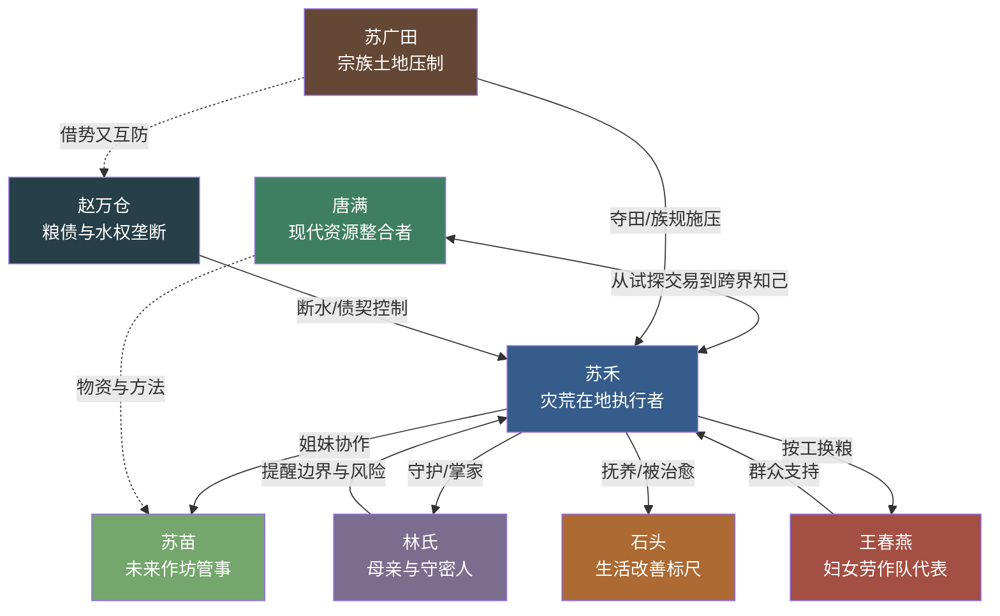

# 《我的地下货仓通荒年》角色档案

> 版本：V1.0  
> 对应创作方案：V2.1·女频种田版  
> 制作模式：国内 AI 漫剧，古风写实 3D CG＋治愈田园＋轻奇幻空间反差

## 一、角色设计总则

- 双女主必须一眼分属两个世界：唐满是现代功能装，苏禾是灾年旧布衣。
- 前期所有古代角色都保留饥荒痕迹，不用精致妆容和洁净华服弱化处境。
- 反派不统一使用黑衣、凶脸；苏广田表现宗族权威，赵万仓表现富商秩序，两人的压迫方式必须不同。
- 唐满负责语言和动作喜剧，苏禾负责决断、执行与经营成果。不能让唐满的玩笑破坏灾情重量。
- 服装随事业升级逐步改善，但角色标志色、发型轮廓和核心道具保持稳定。

## 二、核心角色

## 1. 唐满

| 字段 | 设定 |
|---|---|
| 角色定位 | 现代女主；资源整合者与主要喜剧来源 |
| 年龄外貌 | 29 岁，圆润明快的脸型，眼睛有神，动作幅度大，常因搬货把头发弄乱 |
| 性格特征 | 大大咧咧、自来熟、反应快、嘴贫但守信用 |
| 公开身份 | 小型农产品供应链与库存清理公司的老板 |
| 真实能力 | 熟悉采购、库存、运输、砍价和简单机械维修，善于把有限资源拼成可执行方案 |
| 当前目标 | 处理积压库存、稳住现金流，查清地下货仓的异常 |
| 核心动机 | 证明自己做的不是低端倒货，而是一门能解决真实问题的事业 |
| 内在缺陷 | 容易先动手后评估；习惯用现代常识判断陌生环境；压力越大越爱开玩笑 |
| 核心冲突 | 她能低价获得现代物资，却不能无限运输，也不能保证现代方法适合古代 |
| 爽点功能 | 价格反差、资源调度、现场修理、用商业常识拆穿垄断、笑着完成反击 |
| 代表台词 | “东西我能找，能不能用，得先拿一小块地试。” |

### 视觉锚点

- 发型发色：黑色高马尾，碎发多，忙起来用绿色铅笔随手盘发。
- 标志色：仓库绿＋暖橙色。
- 常驻服装：墨绿色工装马甲、米白短袖、深灰工装裤、橙色劳保手套。
- 标志配饰：腰间卷尺；右手腕有旧电子表。
- 体型轮廓：中等偏结实，肩背有长期搬货形成的力量感。
- 动作习惯：思考时转卷尺；紧张时嘴更快；发现商机时眼睛先亮、手已经去摸计算器。
- 区分点：全剧唯一长期穿现代工装、使用高马尾和鲜橙配件的角色。

### 常用表情

| 情绪 | 画面描述 |
|---|---|
| 嘴硬心虚 | 下巴抬高，视线却悄悄偏开，手指无意识拨卷尺卡扣 |
| 发现商机 | 眼睛骤亮，眉峰上挑，嘴角压不住地上扬 |
| 认真计算 | 笑意收住，眉心轻蹙，快速在纸箱背面写数字 |
| 被现实打脸 | 嘴微张，停顿两秒，再若无其事地把话圆回来 |
| 真正心疼 | 不再说笑，目光落在对方的手或空碗上，动作明显放轻 |

### 角色弧线

| 阶段 | 集数 | 状态变化 |
|---|---:|---|
| 起点 | 1—3 | 把异常当成舅公遗物和仓库失窃，首先考虑止损 |
| 试探 | 4—12 | 与苏禾只谈价格和规则，在一次次验货中建立最低信任 |
| 崛起 | 13—30 | 从送成品转向组织工具、资料和小规模试验，现代事业也开始转型 |
| 受挫 | 31—42 | 错判气候导致试验田受损，意识到“知道答案”不等于“答案能落地” |
| 成熟 | 43—52 | 学会把选择权交给苏禾，只提供选项、风险和资源 |
| 蜕变 | 53—60 | 在重量限制下选择生产资料而非救济粮，成为真正的跨界供应链守门人 |

## 2. 苏禾

| 字段 | 设定 |
|---|---|
| 角色定位 | 灾荒世界女主；在地执行者与未来粮城主事人 |
| 年龄外貌 | 22 岁，清瘦，肤色被日晒成浅麦色，眼下有缺粮留下的淡青，眼神稳定 |
| 性格特征 | 警惕、坚韧、重结果、敢担责 |
| 公开身份 | 父亲失踪、肥田被夺的苏家长女 |
| 隐藏筹码 | 识字、熟悉本地水土农时，知道父亲秘密粮窖和部分旧渠线索 |
| 当前目标 | 在三个月内收出足够粮食，保住老宅和三亩荒地 |
| 核心动机 | 不让母亲和弟妹被拆散，更不接受女人只能依附宗族才能活下去 |
| 内在缺陷 | 习惯独自承担，宁愿冒险也不愿让家人知道全部危险；前期过度防备外人 |
| 核心冲突 | 她急需粮食，却不能确认跨界物资是否安全；她需要合作，又不能把全家性命交给陌生人 |
| 爽点功能 | 极限求生、因地制宜、以成果夺回话语权、建立公平分粮规则 |
| 代表台词 | “你给的是法子，地里长出来的，才算我们的本事。” |

### 视觉锚点

- 发型发色：乌黑长发低束，使用一段洗旧的靛蓝布绳，不戴首饰。
- 标志色：靛蓝＋土褐色。
- 常驻服装：补丁短褐、窄袖旧布衣、绑腿草鞋；劳作时袖口扎紧。
- 标志道具：短柄柴刀；父亲留下的水渠旧图被缝在腰带夹层。
- 体型轮廓：清瘦挺直，肩窄但站姿不缩，手指有农活裂口。
- 动作习惯：进陌生处先看出口；做决定前捻一粒土；说重话时声音反而更低。
- 区分点：低束长发、靛蓝头绳与始终挺直的单薄轮廓。

### 常用表情

| 情绪 | 画面描述 |
|---|---|
| 戒备 | 下颌收紧，身体微侧护住退路，右手停在柴刀柄旁 |
| 判断 | 眉心轻锁，拇指缓慢碾过土粒或谷粒，不急着回答 |
| 隐忍 | 眼眶不红，只把嘴唇抿成一条直线，背脊更直 |
| 小胜 | 先确认家人安全，随后才露出很淡的笑 |
| 掌事 | 目光平稳扫过众人，声音不高，却不给争辩空隙 |

### 角色弧线

| 阶段 | 集数 | 状态变化 |
|---|---:|---|
| 起点 | 1—3 | 只想保住家人与土地，把唐满视为危险但可能有用的陌生人 |
| 立足 | 4—12 | 通过验货、留样和小额交换掌握主动，赢下第一次种植机会 |
| 崛起 | 13—30 | 从一家人的掌事人变成妇女劳作队的组织者，建立按工计粮规则 |
| 扩张 | 31—42 | 作坊和旧渠触动既得利益，她必须从会种地升级为会用人、会定规矩 |
| 低谷 | 43—50 | 试验田受损、货仓中断，第一次失去现代侧即时支援 |
| 蜕变 | 51—60 | 独立完成分水、抢收和储粮，被众人推举为聚落主事人 |

## 三、核心配角

## 3. 林氏

| 字段 | 设定 |
|---|---|
| 身份定位 | 苏禾之母；家庭情感核心与秘密粮窖的第二守密人 |
| 年龄外貌 | 45 岁，病中消瘦，鬓边早白，眉眼温和但不软弱 |
| 性格特征 | 谨慎、通透、护女、善察人情 |
| 当前目标 | 活下来，不让三个孩子因自己受制于宗族 |
| 核心动机 | 她曾因顺从失去家中话语权，不愿女儿再走同一条路 |
| 冲突点 | 身体虚弱需要照料，同时她最清楚公开异常粮食会给全家招祸 |
| 爽点功能 | 为苏禾提供家庭认可；在宗族施压时以长辈身份挡回道德绑架 |
| 代表台词 | “别人问粮从哪来，你只答粮从地里来。其余的，一个字也别多说。” |

### 视觉锚点

- 发型：低髻，鬓边两缕灰白发。
- 标志色：灰紫色。
- 标志道具：磨旧木梳；病情好转后改拿针线笸箩。
- 体型轮廓：前期佝偻单薄，中后期逐步坐直、能在院中做活。
- 区分点：灰白鬓发与始终整齐的低髻，显示贫困中仍保持体面。

### 常用表情

| 情绪 | 画面描述 |
|---|---|
| 担忧 | 眉头细蹙，手指反复摩挲木梳边缘 |
| 看穿 | 不立刻拆穿，只安静看着对方，眼神清醒 |
| 护女 | 撑着病体坐直，声音虚弱却一字不让 |
| 欣慰 | 眼角湿润，低头整理针线掩住笑意 |

## 4. 苏苗

| 字段 | 设定 |
|---|---|
| 身份定位 | 苏禾妹妹；从家庭帮手成长为作坊管事 |
| 年龄外貌 | 16 岁，小巧灵活，圆眼，手指纤细，脸上仍有少女感 |
| 性格特征 | 心细、手巧、胆小但有韧劲 |
| 当前目标 | 帮姐姐照顾母亲和石头，不被族中送去换粮 |
| 核心动机 | 想靠自己的手艺成为“有用的人”，而不是被安排去向的人 |
| 冲突点 | 害怕与外人冲突，却必须承担包装、记工和作坊管理 |
| 爽点功能 | 改良本地包装、把不起眼的手艺变成收入、带动更多女性做工 |
| 代表台词 | “我不敢跟他们吵，可账是我记的，一粒粮也不会错。” |

### 视觉锚点

- 发型：双股辫盘在脑后，额前有整齐短刘海。
- 标志色：豆绿色。
- 标志道具：竹尺与针线包。
- 体型轮廓：矮小轻快，走路常贴近姐姐半步，成长后逐渐并肩。
- 区分点：圆眼、短刘海、竹尺，轮廓比苏禾更柔和。

### 常用表情

| 情绪 | 画面描述 |
|---|---|
| 害怕 | 肩膀微缩，手抓住针线包，视线却没有完全躲开 |
| 专注 | 舌尖轻抵上唇，竹尺压稳布料，一针一线极准 |
| 被认可 | 先愣住，再低头笑，耳尖明显发红 |
| 坚定 | 两手抱紧账本，站到姐姐身侧而非身后 |

## 5. 石头

| 字段 | 设定 |
|---|---|
| 身份定位 | 苏禾幼弟；生活改善最直观的情绪标尺 |
| 年龄外貌 | 6 岁，头发枯黄，脑袋显大，前期四肢细瘦 |
| 性格特征 | 懂事、好奇、嘴馋但守规矩 |
| 当前目标 | 让母亲吃饱，希望明天还有一顿饭 |
| 核心动机 | 他把苏禾视为家里最可靠的人，想证明自己不会拖累姐姐 |
| 冲突点 | 年龄太小，既可能无意泄密，也会因过度懂事强化灾荒残酷感 |
| 爽点功能 | 用饭量、衣服和童言反馈日子变好；承担温暖而不油滑的笑点 |
| 代表台词 | “姐，我闻一闻就行，娘吃了才能好。” |

### 视觉锚点

- 发型：枯黄短发，头顶一撮总压不平。
- 标志色：赭黄色。
- 标志道具：缺了一角的小木碗。
- 体型轮廓：前期头大身小，中后期脸颊逐渐有肉。
- 区分点：翘起的一撮头发和缺角木碗。

### 常用表情

| 情绪 | 画面描述 |
|---|---|
| 嘴馋 | 鼻尖追着饭香动，双手却老实背在身后 |
| 懂事 | 咽一下口水，把木碗先推到母亲面前 |
| 惊喜 | 眼睛睁圆，嘴角一下咧开，头顶乱发跟着跳动 |
| 闯祸 | 双手捂嘴，眼睛迅速去找苏禾 |

## 四、对手角色

## 6. 苏广田

| 字段 | 设定 |
|---|---|
| 身份定位 | 前中期对手；借宗族规矩夺取苏家土地的族叔 |
| 年龄外貌 | 48 岁，身材敦实，面方，蓄短须，衣料不华贵但明显比村民完整 |
| 性格特征 | 好面子、精于算计、迷信宗族权威 |
| 公开身份 | 苏氏族中管事人，自称替孤儿寡母“保管”田产 |
| 真实欲望 | 把苏家肥田并入自家，同时维持自己公正长辈的名声 |
| 当前目标 | 逼苏禾交出老宅和荒地，阻止她用收成证明女子也能掌田 |
| 核心动机 | 他相信土地和分配权必须掌握在族中男性长辈手里 |
| 冲突点 | 不能公开抢夺，只能利用契约、舆论和族规施压 |
| 爽点功能 | 每次以规矩压人，最终都被苏禾用更清楚的账、契和成果反制 |
| 代表台词 | “我替你们收着田，是救你们，不是占你们。” |

### 视觉锚点

- 发型：头发梳得紧，戴深褐色方巾。
- 标志色：深褐＋暗红。
- 标志道具：黄铜烟杆；谈规矩时用烟杆敲桌。
- 体型轮廓：敦实宽肩，走路慢，习惯让别人给他让路。
- 区分点：方巾、烟杆与四平八稳的宽大轮廓。

### 常用表情

| 情绪 | 画面描述 |
|---|---|
| 假关心 | 眉眼下压，嘴上叹气，手却已经按住田契 |
| 被顶撞 | 眼皮跳动，烟杆重重敲桌，仍强撑长辈口吻 |
| 算计 | 半眯着眼看地和粮，不看说话的人 |
| 失势 | 想挺直腰，目光却躲开周围村民 |

### 对手弧线

以长辈身份夺田得意 → 秋收赌约中首次被公开顶撞 → 煽动族人断工 → 借试验失败逼收地 → 账目和成果揭穿其私心 → 失去宗族分配话语权。

## 7. 赵万仓

| 字段 | 设定 |
|---|---|
| 身份定位 | 中后期主对手；控制粮价、水源与债契的地方粮商 |
| 年龄外貌 | 42 岁，身形修长，面白，衣着整洁，手上没有劳作痕迹 |
| 性格特征 | 克制、冷酷、擅长定价和制造依赖 |
| 公开身份 | 开仓赈借、帮助灾民度荒的粮行东家 |
| 真实欲望 | 用高息粮债吞并土地，再控制佃户、旧渠和来年种粮 |
| 当前目标 | 查清苏禾稳定粮源和修复旧渠的方法，把她的合作队变成自家佃户 |
| 核心动机 | 他不相信人情，只相信饥饿会让所有人接受价格 |
| 冲突点 | 苏禾建立的按工分粮和公共粮仓，正在破坏他的依赖体系 |
| 爽点功能 | 代表系统性压迫；最终被公开账册、恢复水权和集体储粮击败 |
| 代表台词 | “粮价不是我定的，是饿肚子的人自己定的。” |

### 视觉锚点

- 发型：黑发束入小冠，一丝不乱。
- 标志色：墨青＋冷金色。
- 标志道具：乌木算盘；说话时慢慢拨一颗算珠。
- 体型轮廓：高而窄，长袍垂直，几乎没有多余动作。
- 区分点：冷色长直轮廓，与苏广田的暖褐敦实轮廓完全相反。

### 常用表情

| 情绪 | 画面描述 |
|---|---|
| 估价 | 目光从人脸移到双手和衣着，像在计算能抵多少债 |
| 威胁 | 嘴角仍带礼貌弧度，手指却停住算珠 |
| 意外 | 只有眉梢轻抬，随即重新低头拨算盘 |
| 失控 | 指节压白，算珠被一下拨乱，整齐袖口第一次沾灰 |

### 对手弧线

以赈借之名扩张粮债 → 试图低价收购苏禾成果 → 断水断路施压 → 利用试验失败制造挤兑 → 水利账册暴露侵占证据 → 粮债体系被公共粮仓与恢复水权击穿。

## 五、可转化角色

## 8. 王春燕

| 字段 | 设定 |
|---|---|
| 身份定位 | 普通村妇视角；第一位加入苏禾劳作队、后成为作坊管事的人 |
| 年龄外貌 | 31 岁，身材高壮，肤色深，常背着两岁女儿做活 |
| 性格特征 | 现实、嘴直、护孩子、肯吃苦 |
| 当前目标 | 用劳动换到孩子能吃的粮，不再向赵家粮行借高息粮 |
| 核心动机 | 她不相信口号，只相信当天能不能把粮带回家 |
| 冲突点 | 前期随众质疑苏禾，加入后又夹在村民旧习和新规矩之间 |
| 爽点功能 | 让苏禾的成功获得群众证明；展示普通女性由求粮者变成管理者 |
| 代表台词 | “你别跟我说将来。今天做几垄，换几勺粮，你写清楚。” |

### 视觉锚点

- 发型：粗黑长发盘成高髻，用麻绳固定。
- 标志色：砖红色。
- 标志道具：宽背带和大竹筐。
- 体型轮廓：高壮、有力量，黑色剪影中肩背最宽。
- 区分点：高髻、大竹筐和背孩子形成的双层轮廓。

### 常用表情

| 情绪 | 画面描述 |
|---|---|
| 怀疑 | 双臂抱胸，头微偏，眉毛高低不一 |
| 干活 | 袖子卷高，咬紧后槽牙，动作快而稳 |
| 服气 | 看着实际成果点一下头，不说奉承话 |
| 护队 | 把竹筐往地上一放，整个人挡在作坊门口 |

## 六、关系图

## 七、核心互动场景预设

| 互动类型 | 涉及角色 | 场景与作用 |
|---|---|---|
| 第一次隔界试探 | 唐满、苏禾 | 一袋米被拿走后，苏禾以一枚普通铜钱和纸条问价；唐满发现铜钱在现代极罕见，但不出售，只将它视为异常证据 |
| 第一次正面相遇 | 唐满、苏禾 | 双方各自布置的生活化警报同时生效；柴刀无法穿过边界，唐满以玩笑缓和，苏禾只谈金锭和粮价 |
| 第一次建立信用 | 唐满、苏禾 | 唐满主动归还带官戳的金锭，苏禾如实反馈米的食用结果，双方约定先验货后结算 |
| 第一次方法冲突 | 唐满、苏禾 | 唐满按现代资料主张扩大处理，苏禾因本地夜寒坚持只试一垄；结果苏禾判断正确，确立在地决策权 |
| 第一次家庭守密 | 苏禾、林氏 | 林氏从米袋和纸张判断事情会招祸，要求苏禾只让家人知道“粮从地里来” |
| 第一次公开立威 | 苏禾、苏广田 | 三个月赌约验粮，苏广田拿族规否定她，苏禾用地契、记工簿和实收粮当众反制 |
| 第一次群众转向 | 苏禾、王春燕 | 王春燕不听愿景，只问一日工钱；当晚真的领到粮后，第二天第一个带人来做工 |
| 第一次重大失败 | 唐满、苏禾 | 现代方案水土不服，试验苗受损。两人不互相安慰，先清点损失、追溯变量，再重定试验规则 |
| 中点对决 | 苏禾、赵万仓 | 赵万仓用断水逼合作队解散，苏禾以旧渠支线、轮班取水和公开账目稳住人心 |
| 终局对决 | 苏禾、赵万仓、苏广田 | 水利账册、债契与村民证言同时公开；胜负不靠武力，而是让两名对手失去水权、粮权和宗族话语权 |
| 第一季情感确认 | 唐满、苏禾 | 货仓恢复后，两人不说“姐妹”，只重新核对重量、粮数和修理清单；苏禾把第一捧新粮交给唐满保存 |

## 八、视觉区分度检查

| 角色 | 发型轮廓 | 主色 | 体型 | 标志道具 | 剪影辨识 |
|---|---|---|---|---|---|
| 唐满 | 高马尾 | 仓库绿/橙 | 结实中等 | 卷尺、劳保手套 | 高马尾＋工装口袋 |
| 苏禾 | 低束长发 | 靛蓝/土褐 | 清瘦挺直 | 柴刀 | 低束长发＋窄袖直背 |
| 林氏 | 低髻鬓白 | 灰紫 | 纤弱微佝偻 | 木梳 | 低髻＋前期病弱姿态 |
| 苏苗 | 盘双辫 | 豆绿 | 矮小轻快 | 竹尺 | 短刘海＋小型工具包 |
| 石头 | 短发翘撮 | 赭黄 | 头大身小 | 缺角木碗 | 儿童比例＋翘发 |
| 苏广田 | 方巾束发 | 深褐/暗红 | 敦实宽肩 | 黄铜烟杆 | 方巾＋宽体＋烟杆 |
| 赵万仓 | 小冠束发 | 墨青/冷金 | 高而修长 | 乌木算盘 | 高冠长袍＋纵向轮廓 |
| 王春燕 | 麻绳高髻 | 砖红 | 高壮 | 大竹筐 | 高髻＋背筐/背带 |

结论：八名主要角色在发型、主色、体型和道具上均有独立锚点；唐满与苏禾、苏广田与赵万仓、苏苗与王春燕不存在主要轮廓撞型。

## 九、台词声线边界

- 唐满：现代口语、短句、善用价格和仓储类比；严肃场面减少网络梗。
- 苏禾：措辞克制，先问事实再表态；不说现代经营术语，不随意喊口号。
- 林氏：话少但能点破人情，语气柔而结论硬。
- 苏苗：前期多疑问和复述，成长后用清楚数字说话。
- 石头：只说儿童能理解的吃饭、家人和劳动，不承担成人信息解释。
- 苏广田：频繁使用“族里”“规矩”“替你们着想”，把占有包装成保护。
- 赵万仓：用价格、债期和选择题说话，几乎不直接辱骂。
- 王春燕：口语直接，只认当日劳动和可见回报，后期仍不说漂亮话。

## 十、连续性禁区

1. 苏禾第一次只带走一袋米，是因陌生异响迫使她撤退，不是克制、预判长期交易或只取所需。
2. 苏禾确认米可食后必须立刻返回找剩余粮食，符合灾荒求生本能。
3. “承宁通宝”是苏禾时代的普通小额货币，不是银饰、传家宝或她预知现代价值后的高价付款。
4. 铜钱第一季不用于黑市交易、私拍、伪造来源或批量套现，只承担试探、证物和关系信物功能。
5. 唐满不是农学专家；专业判断必须来自资料、咨询和小规模验证。
6. 苏禾不因一袋米立刻信任唐满；前十集的信任只能来自归还金锭、验货结果、守约和共同承担损失。
7. 两位反派不得降智送证据。苏广田靠宗族程序，赵万仓靠债契、水源和价格施压。
8. 林氏、苏苗和石头不能只做被保护者，三人分别承担守密、作坊与生活反馈功能。
