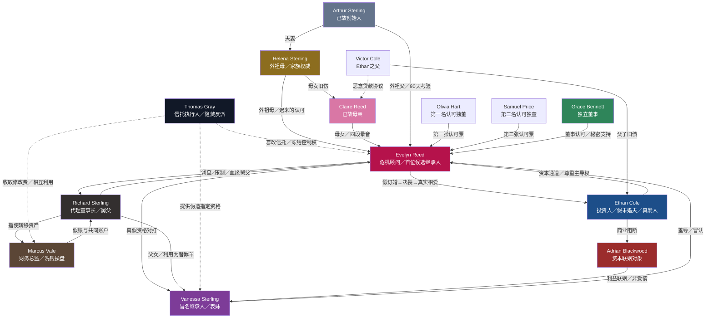

# 《继承人就在你们眼前》角色档案

## 一、角色配置

- **双主角**：Evelyn Reed、Ethan Cole
- **核心配角/反派**：Richard Sterling、Vanessa Sterling、Thomas Gray、Helena Sterling、Marcus Vale
- **功能角色**：Claire Reed、Arthur Sterling、Olivia Hart、Samuel Price、Grace Bennett、Adrian Blackwood
- **主要角色总数**：7人
- **功能角色总数**：6人

角色设计原则：

1. 女主负责调查、取证、夺权与终局陈述。
2. 男主负责资本通道、情感对抗与代价选择，不替女主完成继承。
3. Richard制造家族权力冲突，Marcus制造财务犯罪冲突，Vanessa制造公开羞辱与冒名冲突，Thomas制造规则反转，功能不重叠。
4. Helena承担母女旧伤与家族认可，不能成为万能证人。
5. 每名主要角色拥有不同的语言节奏、肢体习惯和视觉标志。

---

## 二、主要角色总表

| 角色名称 | 身份定位 | 年龄外貌 | 性格特征 | 公开/真实身份 | 目标动机 | 核心冲突 | 爽点功能 |
|---|---|---|---|---|---|---|---|
| **Evelyn Reed** | 女主、危机顾问、首位候选继承人 | 29岁，黑色短西装，常戴Arthur旧戒指；目光稳定，极少慌乱 | 冷静、锋利、克制 | 临时顾问助理 / Claire之女、顶级顾问“E.R.”、15%股东、最终继承人 | 查清母亲死亡、夺回集团、证明自己配得上继承 | 想独自掌控一切，却必须学会信任 | 三层身份揭晓、证据反杀、权力登顶 |
| **Ethan Cole** | 男主、Cole Capital创始人 | 32岁，深色西装，领带常松一格；谈判时转动钢笔 | 理性、强势、守信 | 冷酷收购者 / 愿为原则放弃巨额利益的盟友与爱人 | 完成优质收购，同时摆脱父辈债务 | 爱Evelyn，却可能吞掉她的公司 | 假订婚护短、资本反杀、为爱付出真实代价 |
| **Richard Sterling** | 大反派、代理董事长 | 55岁，银灰头发，定制西装，永远坐主位 | 傲慢、控制、伪善 | 家族守护者 / 长期掏空集团的主谋 | 把集团永远留在自己这一支 | 认为长子身份天然等于继承资格 | 权势压迫、家族羞辱、终局崩塌 |
| **Vanessa Sterling** | 女二反派、冒名继承人 | 27岁，华丽礼服与品牌套装，偏爱祖母绿饰品 | 虚荣、敏锐、好胜 | 品牌副总裁、Arthur孙女 / 伪造最终指定资格的冒名者 | 获得祖父从未给她的认可，成为家族中心 | 她既是加害者，也是被父亲利用的棋子 | 冒名压制、公开对打、被逐层打脸 |
| **Thomas Gray** | 隐藏反派、信托执行人 | 61岁，灰色三件套，戴无框眼镜，文件永远对齐 | 审慎、冷酷、耐心 | 公正律师 / 篡改信托、操纵两派的幕后人 | 控制集团信托及其长期管理费用 | 必须维持中立面具，又要阻止Evelyn完成考验 | 规则反转、至暗打击、隐藏BOSS揭晓 |
| **Helena Sterling** | 家族权威、女主外祖母 | 74岁，银发盘起，手杖只作礼仪不用支撑 | 冷硬、自持、重体面 | 家族女主人 / 当年逼Claire沉默的共犯式母亲 | 保住家族声誉，同时弥补对女儿的伤害 | 想认回Evelyn，却不敢承认自己的错误 | 血缘认可、关键表决权、情感爆发 |
| **Marcus Vale** | 财务反派、执行型帮凶 | 46岁，外表朴素，随身携带黑色计算器和加密U盘 | 谨慎、贪婪、怯懦 | 忠诚财务总监 / 空壳公司与假账操盘手 | 拿钱脱身并让Richard替自己挡罪 | 想两边下注，却被所有人抛弃 | 账目攻防、证据链、反派内讧 |

---

## 三、双主角深度档案

### 1. Evelyn Reed

#### 基本信息

- **年龄**：29岁
- **职业**：企业危机顾问
- **公开职位**：Sterling Group外部危机顾问助理，后升任临时危机主管
- **隐藏身份**：业内匿名顾问“E.R.”
- **血缘身份**：Claire Reed之女、Arthur Sterling外孙女
- **法定权益**：第32集确认继承Claire原有15%股份；第58集取得最终控制权
- **标志物**：Arthur旧戒指、红色证据夹、母亲的四段录音

#### 外貌与动作

- 日常穿剪裁利落的黑、白、深蓝套装，不用昂贵珠宝证明身份。
- 被羞辱时先整理袖口，不立即回嘴；这个动作意味着她在判断对方的漏洞。
- 翻开关键证据前会停一秒，看着对方问：“你确定？”
- 真正紧张时会用拇指摩挲旧戒指内侧，但不让别人看见。

#### 欲望、需求与恐惧

- **表层欲望**：查清母亲死亡、完成90天考验、继承集团。
- **深层需求**：接受“依赖可信之人不等于失去独立”。
- **最大恐惧**：自己最终会变成Richard那种只相信权力的人。
- **错误信念**：只要不把底牌交给任何人，就不会再次失去所爱。
- **最终领悟**：信任不是交出控制权，而是允许另一个人承担相同风险。

#### 能力边界

**擅长：**

- 财务异常识别
- 危机公关与舆论判断
- 合同风险拆解
- 谈判、设局和证据保存
- 在公开场合控制情绪

**不擅长：**

- 直接表达依恋与恐惧
- 面对Helena时保持绝对理性
- 接受别人未经允许的保护
- 处理母亲录音带来的情绪冲击

#### 核心秘密

1. 她进入集团前就知道自己是Arthur的首位候选继承人。
2. 她没有告诉Ethan旧戒指能够解锁母亲录音。
3. 第44集的退出文件从一开始就是追踪Thomas的诱饵。

#### 语言习惯

- 台词短，通常先问问题，再给结论。
- 不说空泛狠话，只说具体后果。
- 愤怒时声音更低，不提高音量。
- 不用“求你相信我”，而说“看证据，再决定信不信。”

**代表台词：**

- “你可以不喜欢我，但账不会替你撒谎。”
- “我不是来求一个姓氏。我来拿回属于我母亲的东西。”
- “Ethan，阻止我犯错，可以。替我选择，不行。”
- “Vanessa，你偷走的不是身份。是九十天后一定会炸开的谎言。”

#### 角色弧线

| 阶段 | 集数 | 状态与变化 |
|---|---:|---|
| 隐忍潜入 | 1—6 | 以普通助理身份观察家族，只相信自己和证据 |
| 能力觉醒 | 7—12 | 公开“E.R.”身份；为救证人放弃第10集异议 |
| 结盟崛起 | 13—25 | 与Ethan签订双向否决及假订婚协议，第一次让别人进入自己的计划 |
| 信任破裂 | 26—32 | 双方秘密曝光；公开Claire之女与15%股东身份 |
| 主动修复 | 33—38 | 不因爱情取消调查，也不再拒绝所有解释；与Ethan真实相爱 |
| 至暗守位 | 39—44 | 最终控制权被冻结，但保住股权、账册和员工 |
| 反击登顶 | 45—58 | 假退诱敌，完成证据链，正式继承集团 |
| 情感圆满 | 59—60 | 接受爱情与合作，仍保有事业与财产边界 |

---

### 2. Ethan Cole

#### 基本信息

- **年龄**：32岁
- **职业**：Cole Capital创始人兼CEO
- **公开身份**：擅长收购困境企业的冷酷投资人
- **剧情身份**：商业对手、假未婚夫、真实爱人
- **标志物**：黑色钢笔、假订婚戒指的合同盒、父亲留下的旧贷款文件

#### 外貌与动作

- 深色西装，谈判结束后才会松开领带。
- 思考时转动钢笔，一旦把钢笔放下，代表决定不可更改。
- 很少替别人拉椅子；第一次在家宴为Evelyn拉开主位，是明确的情感动作。
- 吃醋时不质问感情，只会追问对方的商业价值。

#### 欲望、需求与恐惧

- **表层欲望**：以合理价格收购Sterling Group，证明自己的判断。
- **深层需求**：摆脱父亲“所有关系都可以定价”的价值观。
- **最大恐惧**：Evelyn接近他只是为了使用Cole的资本。
- **错误信念**：只要合同足够清楚，就不会被感情背叛。
- **最终领悟**：承诺的价值不在退出条款，而在有退出权时仍然留下。

#### 能力边界

**擅长：**

- 资本结构、债务重组、收购攻防
- 判断对方真正的谈判底线
- 在媒体与银行之间建立信心
- 对外护短、对内给出替代方案

**不擅长：**

- 面对父亲的道德债保持客观
- 区分“保护Evelyn”与“控制局面”
- 承认自己先动心
- 接受一场自己无法主导的胜利

#### 核心秘密

1. 他早就见过Claire的名字，却没有立即告诉Evelyn。
2. 他父亲Victor签署过逼迫Claire放弃股份的恶意贷款协议。
3. 第36集撤回收购会让Cole Capital损失一笔足以动摇董事会支持的收益。

#### 语言习惯

- 喜欢用交易、价格和条款表达感情。
- 开玩笑时面无表情，让人分不清真假。
- 真正生气时直接叫对方全名。
- 不说“我养你”，而说“我给你资源，决定权归你。”

**代表台词：**

- “我不做慈善。你是我见过最值得下注的人。”
- “这不是救你。是我拒绝让蠢人毁掉一笔好资产。”
- “假婚约到期了。Evelyn Reed，我现在追你，合同之外。”
- “我撤回的是收购，不是立场。”

#### 角色弧线

| 阶段 | 集数 | 状态与变化 |
|---|---:|---|
| 猎人观察 | 1—8 | 把Sterling视为资产，把Evelyn视为稀缺人才 |
| 对手心动 | 9—16 | 交换情报，提出假订婚，仍习惯用合同控制风险 |
| 假戏真心 | 17—25 | 公开护短、初吻，开始把Evelyn利益放在交易之前 |
| 背叛感爆发 | 26—30 | 发现继承秘密，解除假订婚；自己的家族旧案同时曝光 |
| 代价证明 | 31—38 | 撤回收购、承担损失，以行动而非解释修复信任 |
| 平等守护 | 39—50 | 使用否决权要求安全方案，不替女主停止反击 |
| 公开选择 | 51—60 | 与父亲旧罪切割，保持公司独立，真实求婚 |

---

## 四、核心反派档案

### 3. Richard Sterling

- **年龄/身份**：55岁，Sterling Group代理董事长，Arthur长子。
- **视觉标志**：银灰领带、主位座椅、刻有家徽的袖扣。
- **性格核心**：控制、傲慢、极度在意“长子应得”。
- **公开目标**：稳定集团、维护家族。
- **真实目标**：完成资产转移，让自己这一支永久控制集团。
- **核心动机**：Arthur始终认为Claire比他更有商业天赋，他把父亲的否定变成对妹妹及外甥女的恨。
- **最大弱点**：轻视专业人士，认为所有人最终都能用位置或金钱收买。
- **核心秘密**：支付款项让Thomas监控Claire；他以为自己只安排恐吓，没有直接下令制造车祸。
- **与Evelyn的关系**：血缘上的舅父，权力上的主要敌人。
- **与Vanessa的关系**：公开宠爱，实则把女儿当合法外衣和备用替罪羊。
- **语言习惯**：常说“为了家族”；从不直接承认私欲；愤怒时敲桌面两次。

**代表台词：**

- “斯特林不是一个姓。是一张只有赢家能坐的桌子。”
- “你母亲输在太相信感情。你会输在太相信证据。”
- “Vanessa，你是我的女儿。别逼我在你和家族之间选。”

#### 反派弧线

| 阶段 | 集数 | 状态 |
|---|---:|---|
| 稳坐主位 | 1—10 | 羞辱Evelyn，推动Vanessa冒认 |
| 资产联姻 | 11—24 | 借Blackwood联姻转移酒店资产 |
| 权威受损 | 25—36 | Evelyn股东身份公开，董事支持松动 |
| 反扑得逞 | 37—44 | 引爆债务，配合Thomas冻结控制权 |
| 内部崩裂 | 45—54 | Marcus与Vanessa相继动摇，资产轨迹曝光 |
| 全面败落 | 55—60 | 付款指令与共谋证据闭环，被逐出董事会并起诉 |

---

### 4. Vanessa Sterling

- **年龄/身份**：27岁，品牌副总裁，Richard之女。
- **视觉标志**：祖母绿耳环；情绪失控时会摘下一只放在桌上。
- **性格核心**：虚荣、聪明、好胜、缺乏安全感。
- **公开目标**：代表新一代Sterling接管集团。
- **真实目标**：证明祖父没有选择Claire一系是正确的。
- **核心动机**：她一生得到父亲的物质奖励，却从未得到Arthur真正的认可。
- **最大弱点**：把关注误认为爱，把头衔误认为能力。
- **核心秘密**：明知信托补充页并非Arthur原件，仍配合Thomas和Richard使用。
- **与Evelyn的关系**：表姐妹、镜像对手；一个隐藏真实资格，一个依赖伪造资格。
- **语言习惯**：先夸后刺；在人群中故意提高音量；喜欢用“临时的”称呼Evelyn。

**代表台词：**

- “能力可以买来职位，血统才决定谁坐主位。”
- “你穿得像个答案，可惜没人问过你的名字。”
- “父亲，你说过我是唯一不会被牺牲的人。”

#### 反派弧线

| 阶段 | 集数 | 状态 |
|---|---:|---|
| 高位羞辱 | 1—9 | 把Evelyn当临时助理，连续栽赃 |
| 冒认登顶 | 10—18 | 使用伪造资格，享受继承人待遇 |
| 情场与职场受挫 | 19—25 | 假订婚阻断Blackwood方案，桃色造谣失败 |
| 资格裂开 | 26—32 | Evelyn公开Claire血缘与15%股份 |
| 加码攻击 | 33—44 | 借媒体质疑Evelyn诚信，暂时扳回一局 |
| 被父亲抛弃 | 45—49 | 发现Richard准备让她承担伪造文件责任 |
| 有限倒戈 | 50—60 | 提供关键邮件并承担刑责，不洗白、不加入主角阵营 |

---

### 5. Thomas Gray

- **年龄/身份**：61岁，Arthur私人律师、信托执行人。
- **视觉标志**：无框眼镜、灰色文件夹、永远对齐的纸张。
- **性格核心**：耐心、精确、情感冷漠。
- **公开目标**：忠实执行Arthur的90天考验。
- **真实目标**：让两支家族互相消耗，使自己控制信托委员会与集团表决权。
- **核心动机**：他为Sterling服务三十年，却始终只是“雇员”；他认为真正控制家族的人一直是制定规则的自己。
- **最大弱点**：过度相信文件与程序可以覆盖所有现实证据。
- **核心秘密**：篡改诚信附件、协助剪辑Arthur录音、参与掩盖Claire车祸。
- **中立伪装**：
  - 第10集允许全场提出异议，不直接认证Vanessa。
  - 第24集认证对Evelyn有利的付款记录。
  - 第32集承认Evelyn血缘与15%股份。
  - 第40集才用篡改附件冻结最终控制权。
- **语言习惯**：从不说“我认为”，只说“文件显示”；每次威胁都包装成程序提醒。

**代表台词：**

- “感情可以争辩。签名不可以。”
- “我没有否认你是谁，Reed小姐。我只是在判断你配不配。”
- “谁拥有文件，谁就拥有被法庭承认的真相。”

#### 反派弧线

| 阶段 | 集数 | 状态 |
|---|---:|---|
| 公正裁判 | 1—24 | 维持中立，分别给双方希望 |
| 可信度登顶 | 25—32 | 承认女主股权，进一步获得信任 |
| 规则翻脸 | 33—40 | 抛出诚信附件，冻结最终控制权 |
| 操盘暴露 | 41—48 | 女主追到服务器与最终录音 |
| 挟持原件 | 49—55 | 试图用信托原件换取安全退出 |
| 规则反噬 | 56—60 | 电子备案、元数据、证词和资金流击穿文件骗局 |

---

### 6. Helena Sterling

- **年龄/身份**：74岁，Arthur遗孀，Sterling家族女主人。
- **视觉标志**：银色手杖、Claire年轻时的珍珠胸针。
- **性格核心**：冷硬、克制、重体面。
- **公开目标**：维持家族稳定。
- **真实目标**：确认Evelyn是否愿意回到这个曾伤害她母亲的家。
- **核心动机**：她曾认为牺牲Claire能保护全家，八年来一直活在这个错误决定里。
- **最大弱点**：把沉默当保护，把道歉当失去权威。
- **核心秘密**：她知道Claire离开并非自愿，也知道Arthur旧戒指与录音有关，但不知道完整内容。
- **语言习惯**：从不在公开场合叫Evelyn“外孙女”；句子缓慢，擅长用礼貌制造压迫。

**代表台词：**

- “像Claire，不是你的优势。她也输过。”
- “我不是不知道真相。我是不敢让真相毁掉剩下的人。”
- “Evelyn，我没有资格求你原谅。但我可以把票投给你。”

#### 角色弧线

| 阶段 | 集数 | 状态 |
|---|---:|---|
| 缺席权威 | 1—19 | 被所有人提及但不出现 |
| 冷漠归来 | 20—30 | 认出戒指，却否认Evelyn家族身份 |
| 错误曝光 | 31—40 | 承认逼Claire沉默，但仍维护家族体面 |
| 行动赎罪 | 41—57 | 保护证人、公开道歉、交出关键表决权 |
| 接受边界 | 58—60 | 不要求立即团圆，接受Evelyn决定关系距离 |

---

### 7. Marcus Vale

- **年龄/身份**：46岁，Sterling Group财务总监。
- **视觉标志**：黑色计算器、加密U盘；压力大时反复擦眼镜。
- **性格核心**：谨慎、贪婪、怯懦。
- **公开目标**：让集团财务安全度过债务危机。
- **真实目标**：完成最后一次资产转移后离境。
- **核心动机**：他不相信忠诚，只相信自己掌握的账户。
- **最大弱点**：留了过多备份作为自保，最终反成完整证据链。
- **核心秘密**：掌握Richard付款、Thomas文件修改费和Blackwood交易的共同账户。
- **语言习惯**：从不正面否认，只说“数据可以有不同解释”；被逼急会连续报出具体数字。

**代表台词：**

- “账没有消失，只是换了一种归类。”
- “Richard，我替你做账，不替你坐牢。”
- “给我豁免协议，我给你所有账户。”

#### 反派弧线

| 阶段 | 集数 | 状态 |
|---|---:|---|
| 隐形操盘 | 1—12 | 藏在Richard身后转移资金 |
| 对抗顾问 | 13—24 | 与Evelyn进行账目攻防 |
| 两边下注 | 25—40 | 给Thomas留备份，也准备出卖Richard |
| 逃跑失败 | 41—52 | 账户被冻结，成为最先落网的核心反派 |
| 有限供述 | 53—60 | 作为污点证人提供账目，但仍承担刑责 |

---

## 五、功能角色

| 角色 | 身份与功能 | 关键秘密/作用 | 出场原则 |
|---|---|---|---|
| **Claire Reed** | Evelyn母亲、Arthur之女，已故 | 四段录音的声音主体；曾持15%股份；发现Marcus洗钱并为保护女儿制造离家假象 | 仅通过照片、短闪回、录音与视频出现，不大量占用现实戏 |
| **Arthur Sterling** | 集团创始人，已故 | 设立90天信托考验，将旧戒指交给Evelyn；其录音被Thomas剪辑 | 通过遗嘱影像、回忆和他人评价出现，保持权威与神秘 |
| **Olivia Hart** | 52岁，独立董事、前酒店运营总裁 | 第一名认可者；因Evelyn阻止低价出售并保住核心酒店，于第8集投出第一张认可票 | 第6—10集建立支持；第40集依法暂停认可，第43集协助否决裁员，第57集恢复 |
| **Samuel Price** | 64岁，独立董事、审计委员会主席 | 第二名认可者；重程序与原始凭证，第24集因慈善付款证据投出第二张认可票 | 第24集进入主线；第40集暂停认可，第57集依据篡改证据恢复 |
| **Grace Bennett** | 58岁，独立董事、前联邦检察官 | 第三名认可者；第3集产生好感，第39集正式认可，第40集后转为秘密支持 | 第3集铺垫老员工事件，第39—58集承担调查与董事线 |
| **Adrian Blackwood** | 34岁，Blackwood Holdings继承人 | Richard为Vanessa安排的资本联姻对象；真正关心的是Sterling酒店资产，不爱Vanessa | 控制在第14—22集及后期证词，不发展第三者爱情线 |

### 补充关联人物

- **Victor Cole**：Ethan之父。签署过逼迫Claire放弃股份的恶意贷款协议，第51集前后出庭承认事实。功能明确，不进入常驻角色配额。
- **Daniel Ross**：Claire旧案证人、前医院财务主管。第7集匿名发送旧账册页并表明身份，第8集约定交出原件，第9集失联，第10集被绑威胁，第12集获救并提供半本旧账册。

---

## 六、人物关系图

### 阵营说明

- **主角方**：Evelyn、Ethan；Grace后期加入。
- **反派方**：Richard、Marcus；Vanessa前中期属于反派方，后期限度倒戈。
- **隐藏操盘方**：Thomas，表面中立，实际同时利用两派。
- **摇摆/情感方**：Helena，先维护家族体面，后以行动支持Evelyn。
- **遗产与记忆线**：Claire、Arthur不参与现实行动，但持续影响所有核心人物。

---

## 七、核心关系弧线

### 1. Evelyn × Ethan：强强爱情

| 阶段 | 集数 | 关系状态 | 关键动作 |
|---|---:|---|---|
| 商业对手 | 1—8 | 互相欣赏但彼此防备 | Ethan挖角失败；Evelyn反向试探收购底价 |
| 秘密盟友 | 9—15 | 交换情报、设立双向否决 | 共同冻结第一条资产转移通道 |
| 假未婚夫妻 | 16—25 | 公开营业、私下划界、逐渐动心 | 家宴护短、共同出席闭门会议、危机初吻 |
| 双重背叛感 | 26—30 | 解除婚约、被迫合作 | 继承身份与Cole旧案同时曝光 |
| 代价修复 | 31—38 | 先行动后解释 | Ethan撤回收购；Evelyn交出证据备份 |
| 真实恋人 | 39—59 | 平等合作、共同承担 | 否决危险方案但尊重反击；各自守住公司边界 |
| 真实订婚 | 60 | 自愿、公开、无利益交换 | 全新戒指＋婚前协议＋真实求婚 |

**关系红线：**

- Ethan不能替Evelyn公开身份。
- Ethan不能替Evelyn完成终局听证陈述。
- Evelyn不能用感情要求Ethan无条件牺牲公司。
- 双方冲突必须来自利益、秘密或边界，不用低级吃醋拖集数。

### 2. Evelyn × Vanessa：镜像继承人

- Evelyn拥有真实资格却必须隐藏；Vanessa没有最终资格却抢先公开。
- Evelyn靠能力获得认可；Vanessa靠父亲、媒体和伪造文件获得掌声。
- Evelyn害怕依赖；Vanessa害怕被抛弃。
- 第32集不是Vanessa立即退场，而是她从“身份优势”转为“舆论攻击”。
- 第49集Vanessa倒戈不是良心突然发现，而是Richard决定让她顶罪。

### 3. Evelyn × Helena：迟到的母女补偿

- Helena最初把Evelyn视为Claire旧伤的活证据。
- Evelyn不要口头道歉，只看Helena是否愿意承担公开代价。
- Helena第57集交出表决权，是她第一次选择女儿一系而非家族体面。
- 结局不强行拥抱团圆；Evelyn允许Helena参加医院揭幕，已经是关系松动。

### 4. Evelyn × Thomas：能力与规则之争

- Evelyn相信证据，Thomas相信谁控制程序谁就控制证据。
- Thomas前期通过两次“公平裁决”获取Evelyn信任。
- 第40集他不否认女主血缘，只从诚信条款下手，显得更专业、更危险。
- 终局女主不是撕毁规则，而是用电子备案、见证人、元数据和资金流证明Thomas篡改规则。

---

## 八、角色语言区分表

| 角色 | 句长与节奏 | 常用方式 | 禁用表达 |
|---|---|---|---|
| Evelyn | 短句、先问后判 | 事实、后果、反问 | 空泛威胁、哭求相信 |
| Ethan | 简短、冷幽默 | 价格、条款、下注 | 霸总式“我养你”、替女主决定 |
| Richard | 稍长、权威腔 | 家族、责任、传统 | 直接承认贪婪 |
| Vanessa | 快、尖、适合公开传播 | 阴阳夸赞、阶层标签 | 深奥商法术语 |
| Thomas | 极短、程序化 | 文件、规则、资格 | 情绪化辱骂 |
| Helena | 慢、留停顿 | 体面、家名、含蓄否定 | 大哭大喊 |
| Marcus | 犹豫转为数字爆发 | 分类、误差、不同解释 | 英勇宣言 |

---

## 九、角色连续性清单

### Evelyn

- [ ] 第32集前不得公开Claire之女身份。
- [ ] 第40集后仍持有15%股份与查账权。
- [ ] 每段母亲录音必须由旧戒指解锁。
- [ ] 最终证据由她组织并完成陈述。

### Ethan

- [ ] 第26集前不知道Evelyn是首位候选继承人。
- [ ] 第36集撤回收购必须付出明确经济代价。
- [ ] 使用否决权时必须提供替代方案。
- [ ] 第60集使用全新戒指，不沿用假订婚戒指。

### Vanessa

- [ ] 她伪造的是Arthur指定资格，不是出生身份。
- [ ] 第32集后仍可借剪辑录音和媒体维持部分支持。
- [ ] 第49集倒戈出于自保，不突然洗白。

### Thomas

- [ ] 第10、24、32集保持中立或对女主有利。
- [ ] 第40集才首次公开阻断Evelyn。
- [ ] 所有威胁尽量包装成程序语言。

### Helena

- [ ] 她知道Claire受过威胁，但不知道Thomas完整犯罪链。
- [ ] 她的表决权重要，但不能单独决定最终继承。

### 三名独立董事

- [ ] Olivia Hart第8集投出第一张认可票；第40集暂停；第43集协助Grace否决裁员；第57集恢复。
- [ ] Samuel Price第24集投出第二张认可票；第40集依程序暂停；第57集依据附件篡改证据恢复。
- [ ] Grace Bennett第3集只产生好感，第39集才正式投出第三张认可票；第40集后始终秘密支持。

### Richard与Marcus

- [ ] Richard负责决策和施压，Marcus负责账目执行。
- [ ] Richard不完全知道Thomas的终极计划。
- [ ] Marcus的备份必须既能自保，也能反向定罪。

---

## 十、角色阶段出场建议

| 阶段 | 核心出场角色 | 控制重点 |
|---|---|---|
| 1—6集 | Evelyn、Ethan、Vanessa、Richard、Grace | 快速建立女主困境与第一层身份 |
| 7—12集 | 加入Thomas、Marcus、Daniel | 冒认资格、证人危机、付费卡点 |
| 13—19集 | 加入Adrian | Blackwood联姻、假订婚、公开护短 |
| 20—25集 | 加入Helena | 家宴、第二段录音、董事认可 |
| 26—32集 | 双主角、Helena、Thomas、Vanessa | 婚约破裂、旧案、15%股东身份 |
| 33—40集 | 双主角、Richard、Thomas、Marcus | 撤回收购、真实相爱、诚信冻结 |
| 41—48集 | 双主角、Grace、Helena、Thomas | 局部胜利、假退、最终录音 |
| 49—60集 | 全核心角色，逐步淘汰 | 反派内讧、听证会、继承、求婚 |

---

## 十一、下一阶段

角色档案确认后，输入 **`/目录`**。

生成60集完整分集目录时，必须：

1. 严格遵守各角色首次知情时间。
2. 区分三次身份升级。
3. 保持假订婚、第26集决裂、第38集真实恋爱的节奏。
4. 让四段录音分别在第12、24、32、48集解锁。
5. 让Thomas在第40集前保持可信的中立形象。
