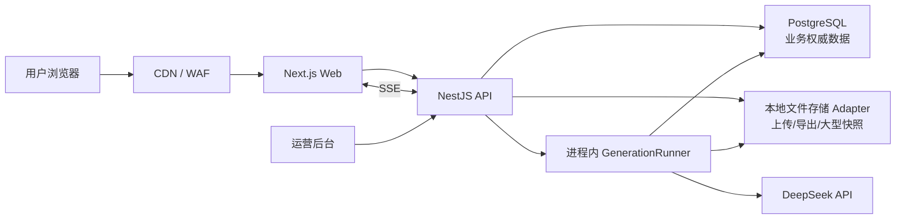
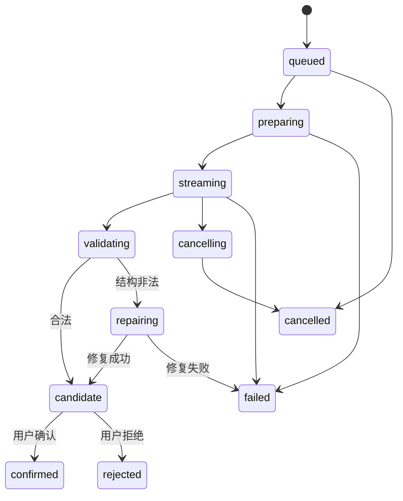

# 墨研小说系统 · 开发设计文档

> 版本：v2.1（Web 主产品版）  
> 修订日期：2026-07-21  
> 对应 PRD：v1.5  
> 当前运行方式：本地开发环境  
> 未来首期规模：约 100 DAU  
> 文档状态：开发基线

---

## 一、架构结论

墨研当前采用完整的 To C Web 架构：

- 用户通过网页完成项目创建、创作、审稿、改编、版本管理、会员购买和导出；
- 服务端统一保存项目正文、设定、大纲、角色、版本、生成记录和用量；
- 服务端根据页面步骤装载对应 Skill、Prompt、项目上下文和输出 Schema；
- 服务端调用 DeepSeek，通过 SSE 向网页转发生成内容；
- PostgreSQL 是业务权威数据源；当前上传、导出和大型快照进入本地文件存储，未来可切换对象存储；
- 当前本地阶段不引入 Redis/BullMQ，生成任务在单个 API 进程内执行，PostgreSQL 保存任务状态；
- Windows/macOS 桌面客户端是未来备选方案，当前不双线开发。

当前先在本地运行 Web、API 和本地安装的 PostgreSQL；上传与导出使用可替换的本地文件存储 Adapter。Redis/BullMQ、云对象存储和生产部署在确有需求时再接入。未来 100 DAU 的文本创作系统仍可使用小规格模块化单体，不需要 Kubernetes、数据库集群或微服务拆分。

---

## 二、优先级与范围

### 2.1 核心顺序

1. To C 网页页面和云端创作体验；
2. Skill 驱动的产品模块与专属创作流程；
3. Skill 外层包装、统一响应、Schema 校验和异常修复；
4. 会员、收费、订单和增长业务。

### 2.2 功能顺序

| 优先级 | 功能 |
|---|---|
| P0 | 注册登录、工作台、项目页面、五章短篇、爽文短剧、AI 漫剧、写手自查、编剧主审、提示词编辑 |
| P0+ | 云端内容/版本、服务端 AI 网关、Skill 快照、结构化协议、任务队列、SSE、上下文组装 |
| P1 | 会员收费、小说转剧本、重构改编、项目导出、基础运营后台 |
| P2 | 长篇小说、长篇记忆、资产库、DOCX/PDF 高级导出 |
| P3 | 视频转写、OCR、视频扒剧本自动化和媒体处理 |

视频扒剧本页面入口可以提前预留，但转写与 OCR 未完成前不能标记为已交付。

---

## 三、总体架构



### 3.1 主要请求路径

普通业务：

```text
浏览器 → Web → API → PostgreSQL/本地文件存储 → 浏览器
```

AI 生成：

```text
浏览器提交生成
→ API 校验用户、权益、项目和步骤
→ 创建 GenerationRun 并冻结额度
→ API 进程内 GenerationRunner 接管运行
→ 组装 Skill/Prompt/上下文
→ 调用 DeepSeek
→ API 通过进程内事件流和 SSE 转发页面
→ 服务端解析和校验最终响应
→ 创建候选版本并结算用量
→ 用户确认后转为正式版本
```

### 3.2 服务边界

| 服务 | 职责 |
|---|---|
| Web | 页面、表单、编辑器、步骤导航、流式展示、用户确认 |
| API | 鉴权、项目、内容、版本、权益、订单、文件、任务接口和本地生成执行 |
| GenerationRunner | API 进程内的 Skill、上下文、DeepSeek 调用、解析、修复和用量模块 |
| Maintenance | 本地阶段通过受控命令或定时器执行清理、过期、索引和导出 |
| Admin | 用户、套餐、订单、模型、Prompt/Skill 发布和审计 |

当前 API、GenerationRunner 和 Maintenance 共享同一 NestJS 进程。引入 Redis/BullMQ 后再把 Runner 拆成独立 Worker 入口，不拆代码仓库。

---

## 四、技术选型

| 层 | 选型 | 说明 |
|---|---|---|
| Web | Next.js App Router + React + TypeScript | 官网、登录后应用、路由和首屏渲染 |
| UI | Ant Design 5 + 墨研 Design Tokens | 表单、步骤、弹窗、表格、导航和业务组件 |
| 编辑器 | Tiptap | 正文、剧本、批注和选区 AI 操作 |
| Web 状态 | TanStack Query + Zustand | 服务端状态、页面状态和流式运行状态 |
| API | NestJS + TypeScript | 模块化单体、鉴权、业务 API、进程内生成、SSE |
| ORM | Prisma 或 Drizzle | PostgreSQL Schema、迁移和类型安全 |
| 数据库 | PostgreSQL | 用户、项目、内容、版本、任务、订单、账本 |
| 缓存/队列 | 当前不引入；未来 Redis + BullMQ | 多实例、可靠后台任务和任务积压出现后再接入 |
| 文件存储 | LocalStorageAdapter；未来 S3 Adapter | 本地保存上传、导出和大型快照，接口保持可替换 |
| Schema | JSON Schema + Ajv strict | 配置、模型响应和接口契约校验 |
| 可观测性 | OpenTelemetry + 日志/指标平台 | 请求、任务、供应商和错误链路 |

Next.js 不承担模型任务。当前由 NestJS 进程内 GenerationRunner 执行生成和结构修复；这适合本地单实例开发，但 API 进程重启会中断正在运行的任务。需要跨重启恢复、多实例或稳定批量任务时，再切换到 Redis/BullMQ Worker。

前端技术基线确认为 React + Ant Design。当前设计默认使用 Next.js App Router 作为 React 应用框架；如果不需要官网 SEO、服务端渲染和统一路由部署，可在开工前改为 Vite SPA，但两者只选择一种，不并行维护。

---

## 五、代码仓库

```text
apps/
  web/                       # Next.js 用户端
  api/                       # NestJS API + 进程内 GenerationRunner
  admin/                     # 内部运营后台
packages/
  contracts/                 # DTO、事件、错误码和公共类型
  schemas/                   # JSON Schema 与 fixtures
  ui/                        # UI 组件与设计变量
  product-flows/             # 产品类型、页面步骤和前端展示定义
  skill-runtime/             # Skill manifest 与 Prompt 编译器
  model-providers/           # DeepSeek 及未来模型 Adapter
  observability/             # 日志、指标、Tracing
skills-source/               # 受控 Skill 原文及引用文件
tools/
  skill-compiler/            # Skill 编译、黄金测试和发布
  data-maintenance/          # 数据修复、迁移和清理工具
docs/
```

依赖规则：

- Web 不直接访问数据库、文件存储或模型供应商；
- API 不在 Controller 中拼 Prompt；
- `product-flows` 描述页面和业务步骤，`skill-runtime` 负责模型提示编译；
- GenerationRunner 只读取已发布 Skill 快照，不读取未审核工作区文件；
- `contracts` 和 `schemas` 同时被 Web、API、GenerationRunner 和测试使用；
- 运营后台不能绕过服务层直接修改确认版本、额度余额或订单状态。

---

## 六、Web 页面设计

### 6.1 路由

```text
/
/features
/pricing
/help
/login
/register

/app
/app/projects
/app/projects/new
/app/projects/:projectId
/app/projects/:projectId/:module/:step
/app/review
/app/adaptation
/app/assets
/app/tasks
/app/account
/app/account/membership
/app/account/usage
/app/account/orders
```

### 6.2 页面组件层次

```text
ProjectLayout
├─ ProjectHeader
├─ ProductStepNavigation
├─ ContextSummary
├─ StepPage
│  ├─ InputForm
│  ├─ PromptSettings
│  ├─ GenerationToolbar
│  ├─ StreamingResult
│  ├─ CandidateComparison
│  └─ ConfirmationBar
└─ TaskDrawer
```

### 6.3 页面状态来源

| 状态 | 来源 |
|---|---|
| 用户、会员、项目、步骤、内容版本 | API + TanStack Query |
| 表单未保存内容、弹窗、选择项 | 页面本地状态 |
| 生成增量、连接状态、临时草稿 | SSE Store |
| 正式步骤状态和是否解锁 | 服务端返回 |

页面不得根据模型文案自行把步骤改成“已完成”。刷新后以服务端状态为准。

### 6.4 编辑保存

- 编辑内容使用防抖自动保存；
- 请求携带 `base_version` 或 ETag；
- 服务端检测并发修改，冲突返回 409；
- 409 时页面保留当前草稿并展示服务器版本差异；
- 离开存在未保存内容的页面前进行提示；
- 浏览器临时草稿可以保存在 IndexedDB，但只作为断网恢复辅助，不是正式版本。

---

## 七、服务端模块

| 模块 | 职责 |
|---|---|
| Auth | 注册、登录、刷新、找回、会话撤销 |
| User | 资料、设置、隐私请求 |
| Project | 项目、类型、状态、归档、删除 |
| Step | 步骤状态、依赖、确认和失效传播 |
| Artifact | 内容产物、版本、比较和回退 |
| Prompt | 默认 Prompt、用户覆盖、运行快照 |
| Skill | Manifest、发布快照、Schema 和版本 |
| Context | 上下文选择、裁剪、摘要和记忆 |
| Generation | PostgreSQL 运行记录、进程内执行、SSE、取消、重试 |
| ModelGateway | DeepSeek Adapter、模型路由、限流和降级 |
| Review | 写手自查、主审、批注和复审 |
| File | 上传、扫描、本地文件存储和下载；未来切换对象存储 |
| Export | Markdown/TXT/DOCX/PDF 导出 |
| Membership | 套餐、权益和功能检查 |
| Billing | 额度、订单、支付和退款 |
| Admin | 内部配置、发布和审计 |

模块只能通过公开 Service 接口依赖，不跨模块直接写表。项目删除、内容确认、支付发权和额度结算使用事务或事务 Outbox。

---

## 八、Skill 编译与发布

### 8.1 发布流程

```text
Skill 原文/references/templates/examples
→ 人工选择适用产品与页面步骤
→ 标记用户输入、确认节点、自动动作和依赖
→ 拆分 Prompt 片段
→ 配置上下文规则
→ 绑定输入/输出 Schema 和业务校验器
→ 黄金样例测试
→ 生成不可变 Published Snapshot
→ staging 验证
→ 发布
```

### 8.2 Manifest 示例

```yaml
product_mode: short_novel_five_chapter
skill_key: short-novel-skill
skill_version: 2026.07.1
steps:
  - key: outline
    page: outline-editor
    user_confirmation: true
    prompt_fragments:
      - short-novel/core-method
      - short-novel/outline-template
    context:
      required: [project.brief]
      optional: [project.references]
    output_schema: short_novel.outline.v1
    artifact_type: outline
  - key: characters
    page: character-cards
    depends_on: [outline]
    user_confirmation: true
    output_schema: short_novel.characters.v1
```

### 8.3 版本规则

- 已发布快照不可原地修改；
- 新项目默认使用当前发布版本；
- 每次运行保存实际 Skill 版本、Prompt 快照和 Schema ID；
- 已有项目默认继续使用原版本；
- 升级需运行兼容检查并提示受影响步骤；
- 发现严重错误时可以停止新运行，但不得删除历史快照。

---

## 九、Prompt 组装

```text
平台安全和响应协议
→ 产品类型与当前步骤目标
→ 对应 Skill 方法、规则、模板和必要示例
→ 已确认项目上下文
→ 页面结构化输入
→ 用户项目级提示词覆盖
→ 用户本次追加要求
→ 输出 Schema 和禁止越权说明
```

规则：

- 只装载当前步骤需要的 Skill 片段；
- 只有确认版本默认进入后续上下文；
- 用户补充可以改变创作偏好，不能删除安全规则、响应协议和权限约束；
- Prompt 快照存储时脱除密钥和请求头；
- 大型上下文保存哈希和引用，必要时将完整快照压缩后存本地文件存储；
- 后台查看完整 Prompt 必须有单独权限和审计。

### 9.1 DeepSeek 配置基线

- API 使用 OpenAI 兼容格式，Base URL 为 `https://api.deepseek.com`；
- 核心创作和审稿默认模型：`deepseek-v4-pro`；
- 摘要、分类、结构修复等低成本步骤可使用：`deepseek-v4-flash`；
- 不再以 `deepseek-chat` 或 `deepseek-reasoner` 作为新项目默认值，这两个旧名称将在 2026-07-24 停用；
- API Key 只通过本地环境变量 `DEEPSEEK_API_KEY` 注入，不写入数据库、Markdown、源码、日志或前端；
- 仓库只提交 `.env.example`，其中保留空值占位符；
- 启动时调用模型列表或最小请求验证配置，失败时阻止真实生成功能进入“可用”状态。

---

## 十、统一模型协议

### 10.1 请求外层

```json
{
  "protocol": "moyan.request.v1",
  "request_id": "req_...",
  "run_id": "run_...",
  "project": {
    "project_id": "prj_...",
    "creation_mode": "short_drama",
    "step_key": "episode_outline"
  },
  "skill": {
    "snapshot_version": "2026.07.1",
    "skill_key": "short-drama",
    "fragments": ["core-method", "episode-outline"]
  },
  "input": {},
  "context": {
    "confirmed_artifacts": [],
    "memory": [],
    "references": []
  },
  "user_prompt": {
    "project_override": "",
    "run_instruction": ""
  },
  "response_contract": {
    "protocol": "moyan.response.v1",
    "schema_id": "short_drama.episode_outline.v1"
  }
}
```

身份、套餐、额度、供应商密钥和数据库写入规则不发送给模型决定。

### 10.2 响应外层

```json
{
  "protocol": "moyan.response.v1",
  "request_id": "req_...",
  "status": "success",
  "result": {
    "content": "供页面展示和编辑的主要内容",
    "content_format": "markdown",
    "structured_data": {},
    "summary": "结果摘要",
    "warnings": [],
    "suggested_actions": []
  },
  "runtime": {
    "model": "provider/model",
    "finish_reason": "stop"
  }
}
```

所有创作主内容固定存放在 `result.content`。角色卡、章节目录、审稿评分、逐场批注和记忆候选放入页面专属 `structured_data`。

### 10.3 解析与修复

```text
保存受控原始响应
→ 提取 JSON
→ 校验统一响应 Schema
→ 校验页面专属 Schema
→ 校验章节数、集号、必填项等业务规则
→ 成功：创建 candidate 版本
→ 失败：执行一次只修结构的模型请求
→ 仍失败：运行失败，释放或修正额度
```

禁止通过正则从任意自然语言中猜测最终结构；禁止结构校验失败后写入正式版本。

---

## 十一、生成任务与流式事件

### 11.1 状态机



### 11.2 当前本地任务执行

| 任务 | 当前方式 | 未来方式 |
|---|---|---|
| ai-generation | API 进程内 GenerationRunner | Redis/BullMQ Worker |
| ai-batch | 暂不开放，或限制为串行子任务 | BullMQ 父子任务 |
| document-export | P2 前暂不执行 | 独立导出 Worker |
| media-processing | P3 前暂不执行 | 独立媒体 Worker |
| maintenance | 本地命令或轻量定时器 | Maintenance Worker |

当前只允许单实例 API。创建任务后先在 PostgreSQL 写入 `queued`，再由进程内 Runner 领取并更新状态。API 进程重启时，启动恢复逻辑将残留的 `preparing/streaming/validating` 标记为 `interrupted`，用户可重新执行；当前阶段不承诺任务跨进程重启自动续跑。

出现以下任一条件后引入 Redis/BullMQ：需要多个 API/Worker 实例、需要任务跨重启自动恢复、开放批量生成、同时生成明显排队、SSE 事件需要跨实例分发，或定时/补偿任务数量明显增加。

### 11.3 SSE 事件

```text
run.started
run.progress
content.delta
run.warning
run.parsing
run.repairing
run.completed
run.failed
run.cancelled
```

- `content.delta` 只用于实时展示；
- `run.completed` 携带完整标准响应和候选版本 ID；
- 浏览器短暂断线后在同一进程内使用最后事件 ID 重连；无法续接时查询 PostgreSQL 中的最终状态；
- 进程内只保留短期事件缓冲，生成中的部分正文每隔数秒检查点写入 PostgreSQL；
- SSE 丢失不能导致任务丢失。

### 11.4 幂等、取消和重试

- 创建运行使用 `user_id + project_id + step + client_request_id` 幂等；
- API 重试不得重复创建任务或冻结额度；
- 供应商限流和瞬时网络错误指数退避；
- 业务 Schema 错误只允许一次结构修复，不循环重试；
- 取消先写 `cancelling`，GenerationRunner 收到后终止 DeepSeek 请求；
- 已产生模型用量时按明确规则结算，不伪装为零成本失败。

---

## 十二、项目步骤与内容版本

### 12.1 步骤状态

```text
not_started
available
editing
generating
awaiting_confirmation
completed
skipped
needs_review
failed
```

服务端根据 Manifest、前置步骤、当前确认版本和用户权益计算状态。网页只展示结果。

### 12.2 内容版本

| 状态 | 含义 |
|---|---|
| draft | 用户草稿或自动保存版本 |
| candidate | AI 生成且通过校验、尚未确认 |
| confirmed | 用户确认，可进入下游上下文 |
| archived | 被新版本替代但可恢复 |
| rejected | 用户拒绝，不进入下游上下文 |

确认操作在同一数据库事务中：

```text
锁定步骤
→ 校验 candidate 归属和 base_version
→ 将 candidate 标记 confirmed
→ 归档旧 confirmed
→ 更新 ProjectStep
→ 标记受影响下游 needs_review
→ 写 Outbox 事件
→ 提交事务
```

### 12.3 上游变更

修改已确认大纲、角色或目录时，不删除下游正文。系统保存依赖版本列表和内容哈希，将下游标记为待复核，用户选择保留、人工修改或重新生成。

---

## 十三、长篇记忆与上下文（P2）

### 13.1 记忆类型

- 世界观与规则；
- 人物基础档案；
- 人物当前状态；
- 人物关系；
- 章节摘要；
- 时间线；
- 伏笔新增、推进和回收；
- 已确认事实和禁改事实。

### 13.2 上下文选择

```text
当前步骤强依赖内容
→ 项目设定与角色核心信息
→ 当前章节/分集对应目录与细纲
→ 最近章节全文或摘要
→ 活跃人物状态与伏笔
→ 用户指定参考资料
→ 按 Token 预算裁剪
```

首期长篇优先使用结构化摘要和明确依赖，不提前引入向量数据库。只有数据证明检索质量或上下文规模成为瓶颈时再评估向量检索。

---

## 十四、数据库设计

### 14.1 通用约定

- 主键使用 UUID/ULID；
- 时间统一 UTC；
- 业务表含 `created_at`、`updated_at`；
- 可恢复删除使用 `deleted_at`；
- 金额使用最小货币单位整数；
- Token 和额度使用整数；
- JSONB 只用于变化结构和运行快照，不代替全部关系模型；
- 所有项目查询带 `user_id` 或通过项目归属服务鉴权。

### 14.2 核心表

```text
users
user_settings
auth_identities
sessions

projects
project_steps
artifacts
artifact_versions
artifact_dependencies
prompt_overrides
memory_records

generation_runs
generation_events
usage_records
file_objects
exports

skill_definitions
skill_snapshots
skill_step_configs
schema_registry

plans
entitlements
subscriptions
orders
payments
refunds
credit_ledger

outbox_events
audit_logs
```

### 14.3 关键唯一约束

- `projects(user_id, id)`；
- `project_steps(project_id, step_key, step_instance_key)`；
- `artifacts(project_id, type, logical_key)`；
- `artifact_versions(artifact_id, version)`；
- `generation_runs(user_id, idempotency_key)`；
- `credit_ledger(source_type, source_id, type)`；
- `payments(provider, provider_transaction_id)`；
- `skill_snapshots(skill_key, version)`。

### 14.4 文本存储策略

- 频繁读取、需要事务确认的正文和结构化内容可保存在 PostgreSQL；
- 当前上传原件、导出文件和超大运行快照保存在本地文件存储；生产环境再切换对象存储；
- 100 DAU 阶段不需要为了文本正文单独引入文档数据库；
- 若运行快照增长超过预期，将原始响应压缩写入文件存储，数据库保留标准响应、哈希和存储 Key；
- 失败运行和调试快照设置独立保留期限。

---

## 十五、API 设计

### 15.1 通用响应

```json
{
  "data": {},
  "request_id": "req_..."
}
```

错误响应：

```json
{
  "error": {
    "code": "PROJECT_VERSION_CONFLICT",
    "message": "内容已在其他位置更新",
    "details": {}
  },
  "request_id": "req_..."
}
```

### 15.2 核心接口

```text
POST   /v1/auth/register
POST   /v1/auth/login
POST   /v1/auth/refresh
POST   /v1/auth/logout
GET    /v1/me

GET    /v1/projects
POST   /v1/projects
GET    /v1/projects/:id
PATCH  /v1/projects/:id
DELETE /v1/projects/:id

GET    /v1/projects/:id/steps
GET    /v1/projects/:id/artifacts
POST   /v1/projects/:id/artifacts/:logicalKey/drafts
POST   /v1/projects/:id/artifacts/:logicalKey/confirm
GET    /v1/artifacts/:id/versions
POST   /v1/artifact-versions/:id/restore

GET    /v1/projects/:id/prompts/:stepKey
PUT    /v1/projects/:id/prompts/:stepKey
DELETE /v1/projects/:id/prompts/:stepKey

POST   /v1/projects/:id/generation-runs
GET    /v1/generation-runs/:id
GET    /v1/generation-runs/:id/events
POST   /v1/generation-runs/:id/cancel
POST   /v1/generation-runs/:id/retry

POST   /v1/projects/:id/files/upload-intent
POST   /v1/files/:id/complete
GET    /v1/files/:id/download

GET    /v1/plans
GET    /v1/subscription
GET    /v1/usage
POST   /v1/orders
```

所有变更接口使用鉴权、归属校验和必要的幂等键。API 不接受客户端指定确认版本的 `user_id`、真实 Token 用量或额度余额。

---

## 十六、鉴权、安全与隐私

### 16.1 会话

- Access Token 短期有效；
- Refresh Token 使用 HttpOnly、Secure、SameSite Cookie；
- Refresh Token 服务端哈希保存并支持轮换；
- 修改密码、注销账号和异常登录可撤销相关会话；
- 所有变更请求校验 Origin/CSRF；
- 登录、生成、上传、导出和支付分别限流。

### 16.2 数据隔离

- Repository 查询带用户归属条件；
- 服务层统一执行项目权限检查；
- 下载只返回短期签名地址或通过鉴权流式返回；
- P1 可增加 PostgreSQL Row-Level Security 作为纵深防护；
- 后台代查用户内容必须有单独权限、原因和审计。

### 16.3 模型与 Prompt

- 模型 API Key 只存服务端密钥管理系统；
- 用户上传内容视为不可信数据，不能覆盖系统安全指令；
- Skill 发布前人工审核；
- Prompt 快照脱敏，不保存密钥、Cookie 和请求头；
- 模型不能决定权益、额度、确认状态或下一步解锁；
- 供应商数据使用范围在隐私政策中明确。

### 16.4 Web 与文件安全

- Markdown 转 HTML 后使用白名单清洗；
- 配置 CSP，禁止任意内联脚本；
- 上传校验大小、MIME、扩展名、哈希和病毒风险；
- 外部 URL 抓取功能防 SSRF；
- 对象 Key 不使用原始文件名拼接路径；
- 错误响应不返回调用栈、SQL、密钥和供应商原始错误全文。

### 16.5 删除

用户删除项目：

```text
立即标记删除并禁止访问
→ 延迟永久删除
→ 删除数据库内容和文件存储对象
→ 清理进程内/搜索缓存
→ 保留法律或财务所需的最小去内容化记录
→ 记录删除结果
```

---

## 十七、会员、额度和支付

### 17.1 权益检查点

- 创建项目；
- 选择创作类型和高级模型；
- 创建生成运行；
- 批量生成和高级审稿；
- 项目数量、版本保留和存储空间；
- DOCX/PDF 导出；
- 视频/OCR 工具。

### 17.2 额度账本

```text
GenerationRun
→ UsageRecord（供应商真实用量）
→ PricingPolicy（计费规则）
→ CreditLedger（用户可见额度）
```

供应商真实用量不可因套餐变化而改写。用户额度通过不可变账本派生，冻结、扣除、退款、过期和补偿均留下来源。

### 17.3 生成结算

```text
权益检查
→ 估算并冻结额度
→ 执行生成
→ 成功：按真实用量结算，多退少补
→ 系统失败：释放冻结
→ 用户取消：按已发生用量执行明确规则
```

### 17.4 支付

- 商户订单号全局唯一；
- 支付回调验签；
- 供应商交易 ID 唯一；
- 重复回调不重复发放权益；
- 支付成功和权益发放使用事务 + Outbox；
- 发放失败可补偿，不反向伪造支付失败。

---

## 十八、文件、搜索与导出

### 18.1 文件存储

```text
users/{userId}/projects/{projectId}/uploads/{fileId}/{safeFilename}
users/{userId}/projects/{projectId}/exports/{exportId}/{filename}
users/{userId}/projects/{projectId}/run-snapshots/{runId}.json.gz
```

当前 `LocalStorageAdapter` 将文件写入项目配置的本地数据目录，API 通过鉴权接口访问，不把任意文件路径暴露给网页。数据库记录文件归属、原名、MIME、大小、哈希、存储 Key、状态和删除时间。未来切换 S3 Adapter 时保持相同业务接口。

### 18.2 搜索

P0 使用 PostgreSQL 对项目名、标题、角色名和规范化关键词检索。正文搜索可先使用 `ILIKE` 或 PostgreSQL 全文能力。100 DAU 阶段不引入 Elasticsearch。

### 18.3 导出

- P1：Markdown/TXT 直接或短任务导出；
- P2：DOCX/PDF 进入 `document-export` 队列；
- 导出锁定内容版本，避免生成过程中正文变化；
- 当前完成后写本地文件存储并通过鉴权接口下载；生产环境切换对象存储后返回短时签名地址；
- 导出文件设置生命周期，用户可重新生成。

---

## 十九、缓存与性能

| 内容 | 位置 | 失效方式 |
|---|---|---|
| 已发布 Skill 快照 | 进程内缓存 | 版本号变化或进程重启 |
| 用户/权益摘要 | 当前直接查询 PostgreSQL | 后续 Redis 短缓存 |
| 项目概览 | 当前直接查询 PostgreSQL | 后续按指标决定是否缓存 |
| SSE 临时事件 | 进程内短缓冲 | 后续 Redis Stream |
| 静态资源 | CDN | 构建哈希 |

性能策略：

- 项目和版本列表游标分页；
- 章节列表只返回摘要，不返回全部正文；
- 当前章节按需加载；
- 大型上下文在 GenerationRunner 组装；
- `user_id + updated_at`、`project_id + logical_key` 等高频条件建索引；
- 生成并发按用户、套餐、模型和供应商限制；
- SSE 禁用会破坏实时性的代理缓冲；
- 定期检查慢查询、连接池等待和队列积压。

---

## 二十、100 DAU 容量方案

### 20.1 估算前提

- 100 DAU；
- 每人每天 10～20 次生成；
- 峰值同时在线 20～40 人；
- 峰值同时生成约 5～15 个任务；
- 模型使用外部 API，服务端不部署推理模型；
- 正文以文本为主，上传和大型快照进入对象存储。

### 20.2 推荐配置

| 组件 | 推荐起步规格 |
|---|---|
| Web | 2核4GB × 1，或托管 Web 平台 |
| API + Worker | 4核8GB × 1 |
| PostgreSQL | 托管 2核4GB、100GB SSD、自动备份 |
| Redis | 1GB |
| 对象存储 | 100～200GB，按量扩容 |
| 公网 | 5～10Mbps 或按流量计费，静态资源走 CDN |

内测期可以使用一台 4核8GB 主机同时运行 Web、API、Worker、PostgreSQL 和 Redis，但正式收费后建议将 PostgreSQL 迁至托管实例。高可用需求出现时优先增加第二个 API/Worker 实例，而不是盲目升级到更大单机。

### 20.3 存储增长

若每次生成的 Prompt、上下文和响应快照平均 250KB：

```text
100 × 15次/日 × 250KB × 30日 ≈ 11GB/月
```

正文自身很小，运行快照和历史版本才是增长主体。建议：

- PostgreSQL 保存标准化结果、关系、索引和必要正文；
- 大型原始响应压缩后进入对象存储；
- 失败运行、临时流和调试快照设置 30～90 天保留期；
- 确认版本长期保存；
- 每月检查数据库增长、对象存储增长和备份大小。

### 20.4 扩容触发条件

- API CPU 持续高于 60% 或事件循环延迟明显；
- 数据库连接池长期等待或慢查询明显增加；
- AI 队列高峰等待超过产品目标；
- Redis 内存超过 70%；
- 数据库使用量超过已购空间 70%；
- 单机维护已经造成不可接受停机。

100 DAU 下通常不需要数据库只读实例、分库分表、Kubernetes、Elasticsearch 或独立消息中间件。

---

## 二十一、可观测性

### 21.1 关联标识

```text
request_id
user_id（日志中脱敏）
project_id
run_id
queue_job_id
provider_request_id
```

### 21.2 关键指标

- 页面/API P95；
- 自动保存成功率和 409 冲突率；
- 生成排队时间、首段时间和总耗时；
- 模型成功率、超时率、取消率和供应商限流；
- Schema 首次通过率和修复率；
- 候选确认率、重新生成率和人工修改率；
- 单步骤 Token、成本和用户额度；
- 队列积压、失败和 stalled Job；
- 数据库慢查询、连接池、磁盘和备份；
- 对象存储上传、导出和清理失败。

生产日志不记录密码、Cookie、密钥、支付信息、完整正文和完整 Prompt。

---

## 二十二、测试设计

### 22.1 测试分层

| 层级 | 重点 |
|---|---|
| 单元测试 | 步骤状态机、Prompt 编译、上下文、Schema、额度、失效传播 |
| 契约测试 | API DTO、SSE、模型 Adapter、支付回调 |
| 集成测试 | 本地 PostgreSQL 事务、进程内 GenerationRunner、文件存储 Adapter 和会话 |
| Skill 黄金测试 | 固定输入和模拟模型输出，验证片段、上下文和结构 |
| 端到端 | 注册 → 建项目 → 生成 → 编辑 → 确认 → 恢复项目 |
| 故障测试 | 超时、断流、队列重试、数据库失败、自动保存冲突 |
| 安全测试 | 越权、XSS、CSRF、SSRF、文件伪装、限流和支付重放 |

### 22.2 P0/P0+ 必测

1. 用户 A 不能读取用户 B 的项目、文件和生成事件；
2. 五章短篇目录不是五章时不能确认；
3. 每种 P0 产品使用不同 Skill 配置和 Schema；
4. 未确认候选不进入下游上下文；
5. 上游确认版本改变后下游标记待复核；
6. 每个 AI 步骤可修改本次提示词并保存项目覆盖；
7. 非法 JSON 自动修复一次，失败后不污染正式内容；
8. 相同幂等键不创建两次运行或重复冻结额度；
9. SSE 断线可重连或查询最终状态；
10. 取消运行不创建确认版本；
11. 自动保存冲突返回 409，不静默覆盖；
12. Skill 更新不改变历史运行快照；
13. 支付重复回调不重复发权益；
14. 数据库备份可以成功恢复到测试环境；
15. 项目删除最终清理本地文件存储对象；
16. 日志不出现完整模型密钥和用户正文。

### 22.3 模拟模型

`FakeModelProvider` 支持合法结构、逐字流、非法 JSON、Schema 缺字段、超时、限流、断流、取消和首次失败后修复成功。CI 不调用真实付费模型。

---

## 二十三、部署与发布

### 23.1 当前本地开发环境

```text
浏览器
→ Next.js Web 本地开发服务器
→ NestJS API + GenerationRunner 本地进程
→ 本机 PostgreSQL
→ 本地文件存储目录
→ DeepSeek API
```

当前不要求 Docker、Redis、MinIO、云服务器或托管数据库。数据库连接通过 `DATABASE_URL` 配置；DeepSeek 密钥通过 `DEEPSEEK_API_KEY` 配置；本地上传和导出根目录通过 `LOCAL_STORAGE_PATH` 配置。所有真实密钥只存在开发者本机未提交的 `.env`。

### 23.2 未来 100 DAU 生产单元

```text
CDN/WAF/HTTPS
Web
API + AI Worker
托管 PostgreSQL
Redis
S3 兼容对象存储
日志与监控
```

本节不属于当前开发部署任务。正式收费或公开测试前建议：

- 数据库启用自动备份和时间点恢复；
- 对象存储私有并设置生命周期；
- 应用部署可回滚镜像；
- 数据库迁移采用 expand → migrate/backfill → contract；
- 生产密钥使用密钥管理服务；
- 不提交 `.env` 和真实密钥。

### 23.3 CI/CD

```text
安装锁定依赖
→ lint
→ typecheck
→ unit tests
→ contract tests
→ Skill 黄金测试
→ build web/api/worker
→ migration validation
→ 关键 E2E
→ staging smoke test
→ 人工批准
→ production 滚动发布
```

---

## 二十四、实施阶段

### 阶段 A：网页和工程骨架（P0）

- Monorepo、CI、环境和设计系统；
- 官网、登录注册、工作台和主导航；
- 项目创建、列表、概览和步骤导航；
- P0 产品页面骨架；
- 模拟生成、编辑保存和错误状态。

验收：用户能从浏览器注册、创建 P0 类型项目并走通全部页面。

### 阶段 B：云端项目与确认链（P0/P0+）

- PostgreSQL 项目、步骤、产物和版本；
- 草稿、候选、确认、回退和失效传播；
- 本地文件存储 Adapter、上传和基础导出；
- 自动保存、409 冲突和跨设备恢复；
- 五章短篇、短剧、漫剧和两类审稿的完整状态。

### 阶段 C：Skill 与真实 AI（P0+）

- Skill Manifest、编译、快照和黄金测试；
- 模型网关、首个供应商 Adapter；
- 统一请求/响应、Ajv 校验和一次结构修复；
- 进程内 GenerationRunner、SSE、取消、重试和幂等；
- 用量记录、成本和测试额度。

验收：所有 P0 类型使用真实 Skill 和真实模型完成闭环。

### 阶段 D：商业化与改编（P1）

- 套餐、权益、额度、订单、支付和退款；
- 小说转剧本、重构改编；
- Markdown/TXT 导出；
- 最小运营后台。

### 阶段 E：完整创作（P2）

- 长篇小说和记忆；
- 资产库；
- DOCX/PDF 高级导出。

### 阶段 F：媒体能力（P3）

- 转写、OCR、视频扒剧本；
- 媒体任务、隐私、生命周期和交付。

桌面客户端不列入 A～F 主线阶段。Web 产品稳定后，根据离线、隐私和本地模型需求重新立项。

---

## 二十五、关键技术决策

| 编号 | 决策 | 原因 |
|---|---|---|
| ADR-001 | Web 为当前主产品，桌面客户端为未来备选 | 聚焦单一交付形态和商业化主线 |
| ADR-002 | Next.js Web + NestJS API/GenerationRunner | 当前本地单进程简单，未来可拆 Worker |
| ADR-003 | 模块化单体 | 100 DAU 不需要微服务复杂度 |
| ADR-004 | PostgreSQL 为业务权威存储 | 事务、版本关系、JSONB 和一致性需求 |
| ADR-005 | 当前不引入 Redis/BullMQ | 本地单实例没有必要承担额外组件复杂度；达到明确触发条件后再加入 |
| ADR-006 | SSE 作为首期生成流 | 当前以服务端到网页单向事件为主 |
| ADR-007 | 当前本地文件存储，接口预留 S3 Adapter | 不阻塞本地开发，同时避免未来迁移改业务层 |
| ADR-008 | Skill 原文只读、运行使用发布快照 | 保证历史可复现和版本稳定 |
| ADR-009 | `result.content` 为统一主内容字段 | 页面和存储可稳定消费 |
| ADR-010 | 候选与确认分离 | 未经用户认可的内容不污染后续上下文 |
| ADR-011 | P0 不引入向量库和 Elasticsearch | 当前规模和明确依赖不需要 |
| ADR-012 | 100 DAU 从 4核8GB API/Worker 起步 | 足以代理外部模型并保留扩容空间 |

---

## 二十六、开发前必须确认

### 26.1 已确认

- 当前主产品：Web 网页端；
- 未来形态：桌面客户端仅作为备选；
- 前端基础：React + Ant Design；
- 数据方式：项目内容、版本和运行记录由服务端保存；
- 首期容量目标：约 100 DAU；
- 当前只在本地运行，不部署云环境；
- 数据库使用本机 PostgreSQL；
- 首个模型供应商使用 DeepSeek；
- 当前不引入 Redis/BullMQ；
- 功能顺序：P0 五章短篇、爽文短剧、AI 漫剧和两类审稿，P1 改编，P2 长篇，P3 媒体。

### 26.2 仍需确认

**开工前需要确定：**

1. React 应用使用 Next.js App Router 还是 Vite SPA；
2. 第一个端到端功能是否确定为“五章短篇”；
3. 正文区域采用完整人工编辑器，还是只读正文 + 选区批注/指令式 AI 修改；
4. 内容权威格式采用 Markdown + JSONB，还是 Tiptap/ProseMirror JSON；
5. 注册登录采用手机号、邮箱还是双方式；
6. DeepSeek 默认模型最终采用 `deepseek-v4-pro`，还是核心创作用 Pro、辅助任务用 Flash；
7. 当前 9 套 Skill 的基线版本、文件范围和冲突裁决负责人；
8. 未来公开测试时的云厂商、服务器地域、域名和是否面向中国大陆用户；当前不阻塞开发。

**不阻塞工程骨架，可以按默认方案先做：**

9. 当前使用本机 PostgreSQL；未来生产默认使用托管 2核4GB/100GB；
10. 当前使用本地文件存储；未来对象存储默认与服务器同厂商、同地域、私有桶；
11. 自动保存默认 3 秒防抖，候选版本保留 90 天，确认版本长期保留，项目删除宽限 30 天；
12. Skill 快照 P0 默认通过代码评审发布，暂不开发完整发布后台；
13. 网页只允许用户编辑“附加创作要求”，内部 Skill/System Prompt 不完整暴露；
14. MVP 默认使用测试额度，不接真实支付，但保留权益、订单和额度数据结构；
15. Prompt 原始快照和模型原始响应默认保留 90 天，确认内容长期保留；
16. 100 DAU 默认单应用实例 + 托管数据库，不要求应用双机高可用；
17. 长篇 P2 首版默认使用结构化摘要，不提前加入向量检索；
18. 桌面客户端、离线编辑、BYOK 和本地模型等 Web 稳定后再立项。

---

## 二十七、技术依据

- [Next.js App Router](https://nextjs.org/docs/app)
- [Next.js Backend for Frontend 指南](https://nextjs.org/docs/app/guides/backend-for-frontend)
- [NestJS Queues](https://docs.nestjs.com/techniques/queues)
- [BullMQ Idempotent Jobs](https://docs.bullmq.io/patterns/idempotent-jobs)
- [BullMQ Retrying Jobs](https://docs.bullmq.io/guide/retrying-failing-jobs)
- [Prisma JSON Fields](https://docs.prisma.io/docs/orm/prisma-client/special-fields-and-types/working-with-json-fields)
- [Ajv Strict Mode](https://ajv.js.org/strict-mode.html)
- [DeepSeek API 快速开始](https://api-docs.deepseek.com/)
- [DeepSeek 模型与价格](https://api-docs.deepseek.com/quick_start/pricing)
- [阿里云 RDS PostgreSQL 实例规格](https://help.aliyun.com/en/rds/apsaradb-rds-for-postgresql/primary-apsaradb-rds-for-postgresql-instance-types)
- [腾讯云 PostgreSQL 实例规格](https://cloud.tencent.com/document/product/409/7562)
- [腾讯云 COS 计费概述](https://cloud.tencent.com/document/product/436/16871/)
